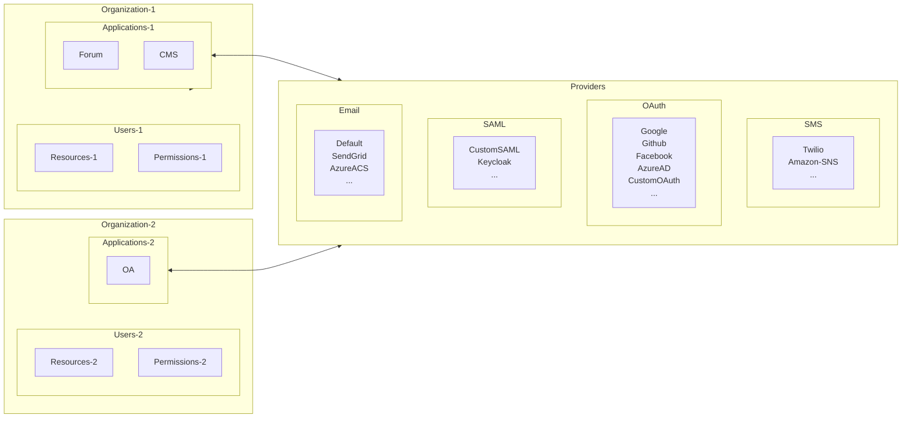

Casdoor is built around four core concepts: **Organization**, **User**, **Application**, and **Provider**. Understanding these will help you configure and operate Casdoor effectively.



:::tip
Examples in this section use the demo site `https://door.casdoor.com`.
:::

## Organization

An **organization** is a container for users and applications—for example, a company’s employees or a product’s customers. The `Organization` struct in code looks like this:

```go
type Organization struct {
    Owner       string `xorm:"varchar(100) notnull pk" json:"owner"`
    Name        string `xorm:"varchar(100) notnull pk" json:"name"`
    CreatedTime string `xorm:"varchar(100)" json:"createdTime"`

    DisplayName        string   `xorm:"varchar(100)" json:"displayName"`
    WebsiteUrl         string   `xorm:"varchar(100)" json:"websiteUrl"`
    Favicon            string   `xorm:"varchar(100)" json:"favicon"`
    PasswordType       string   `xorm:"varchar(100)" json:"passwordType"`
    PasswordSalt       string   `xorm:"varchar(100)" json:"passwordSalt"`
    PhonePrefix        string   `xorm:"varchar(10)"  json:"phonePrefix"`
    DefaultAvatar      string   `xorm:"varchar(100)" json:"defaultAvatar"`
    Tags               []string `xorm:"mediumtext" json:"tags"`
    MasterPassword     string   `xorm:"varchar(100)" json:"masterPassword"`
    EnableSoftDeletion bool     `json:"enableSoftDeletion"`
    IsProfilePublic    bool     `json:"isProfilePublic"`

    AccountItems []*AccountItem `xorm:"varchar(2000)" json:"accountItems"`
}
```

## User

A **user** can sign in to applications. Each user belongs to exactly one organization but can sign in to any application in that organization. Casdoor has two user types:

- **Built-in users** (e.g. `built-in/admin`): Global administrators with full control over the Casdoor instance.
- **Organization users** (e.g. `my-company/alice`): Regular users who can sign up, sign in, sign out, and manage their own profile.

In the API, a user is identified as `<organization_name>/<username>`. The default admin is `built-in/admin`. The `User` struct also has an `id` field (a UUID such as `d835a48f-2e88-4c1f-b907-60ac6b6c1b40`) that applications can use as a stable user ID.

:::tip
For single-organization applications, use `<username>` instead of `<organization_name>/<username>` as the user ID to keep things simple.
:::

The `User` struct:

```go
type User struct {
    Owner       string `xorm:"varchar(100) notnull pk" json:"owner"`
    Name        string `xorm:"varchar(100) notnull pk" json:"name"`
    CreatedTime string `xorm:"varchar(100)" json:"createdTime"`
    UpdatedTime string `xorm:"varchar(100)" json:"updatedTime"`

    Id                string   `xorm:"varchar(100)" json:"id"`
    Type              string   `xorm:"varchar(100)" json:"type"`
    Password          string   `xorm:"varchar(100)" json:"password"`
    PasswordSalt      string   `xorm:"varchar(100)" json:"passwordSalt"`
    DisplayName       string   `xorm:"varchar(100)" json:"displayName"`
    Avatar            string   `xorm:"varchar(500)" json:"avatar"`
    PermanentAvatar   string   `xorm:"varchar(500)" json:"permanentAvatar"`
    Email             string   `xorm:"varchar(100) index" json:"email"`
    Phone             string   `xorm:"varchar(100) index" json:"phone"`
    Location          string   `xorm:"varchar(100)" json:"location"`
    Address           []string `json:"address"`
    Affiliation       string   `xorm:"varchar(100)" json:"affiliation"`
    Title             string   `xorm:"varchar(100)" json:"title"`
    IdCardType        string   `xorm:"varchar(100)" json:"idCardType"`
    IdCard            string   `xorm:"varchar(100) index" json:"idCard"`
    Homepage          string   `xorm:"varchar(100)" json:"homepage"`
    Bio               string   `xorm:"varchar(100)" json:"bio"`
    Tag               string   `xorm:"varchar(100)" json:"tag"`
    Region            string   `xorm:"varchar(100)" json:"region"`
    Language          string   `xorm:"varchar(100)" json:"language"`
    Gender            string   `xorm:"varchar(100)" json:"gender"`
    Birthday          string   `xorm:"varchar(100)" json:"birthday"`
    Education         string   `xorm:"varchar(100)" json:"education"`
    Score             int      `json:"score"`
    Ranking           int      `json:"ranking"`
    IsDefaultAvatar   bool     `json:"isDefaultAvatar"`
    IsOnline          bool     `json:"isOnline"`
    IsAdmin           bool     `json:"isAdmin"`
    IsGlobalAdmin     bool     `json:"isGlobalAdmin"`
    IsForbidden       bool     `json:"isForbidden"`
    IsDeleted         bool     `json:"isDeleted"`
    SignupApplication string   `xorm:"varchar(100)" json:"signupApplication"`
    Hash              string   `xorm:"varchar(100)" json:"hash"`
    PreHash           string   `xorm:"varchar(100)" json:"preHash"`

    CreatedIp      string `xorm:"varchar(100)" json:"createdIp"`
    LastSigninTime string `xorm:"varchar(100)" json:"lastSigninTime"`
    LastSigninIp   string `xorm:"varchar(100)" json:"lastSigninIp"`

    Github   string `xorm:"varchar(100)" json:"github"`
    Google   string `xorm:"varchar(100)" json:"google"`
    QQ       string `xorm:"qq varchar(100)" json:"qq"`
    WeChat   string `xorm:"wechat varchar(100)" json:"wechat"`
    Facebook string `xorm:"facebook varchar(100)" json:"facebook"`
    DingTalk string `xorm:"dingtalk varchar(100)" json:"dingtalk"`
    Weibo    string `xorm:"weibo varchar(100)" json:"weibo"`
    Gitee    string `xorm:"gitee varchar(100)" json:"gitee"`
    LinkedIn string `xorm:"linkedin varchar(100)" json:"linkedin"`
    Wecom    string `xorm:"wecom varchar(100)" json:"wecom"`
    Lark     string `xorm:"lark varchar(100)" json:"lark"`
    Gitlab   string `xorm:"gitlab varchar(100)" json:"gitlab"`
    Apple    string `xorm:"apple varchar(100)" json:"apple"`
    AzureAD  string `xorm:"azuread varchar(100)" json:"azuread"`
    Slack    string `xorm:"slack varchar(100)" json:"slack"`

    Ldap       string            `xorm:"ldap varchar(100)" json:"ldap"`
    Properties map[string]string `json:"properties"`
}
```

:::tip
The `Properties` field is a key-value map for custom user attributes. See [User overview](/docs/user/overview#using-the-properties-field) for usage and best practices.
:::

## Application

An **application** is a web service that uses Casdoor for authentication—for example, a forum, an internal OA system, or a CRM.

```go
type Application struct {
    Owner               string          `xorm:"varchar(100) notnull pk" json:"owner"`
    Name                string          `xorm:"varchar(100) notnull pk" json:"name"`
    CreatedTime         string          `xorm:"varchar(100)" json:"createdTime"`
    DisplayName         string          `xorm:"varchar(100)" json:"displayName"`
    Logo                string          `xorm:"varchar(100)" json:"logo"`
    HomepageUrl         string          `xorm:"varchar(100)" json:"homepageUrl"`
    Description         string          `xorm:"varchar(100)" json:"description"`
    Organization        string          `xorm:"varchar(100)" json:"organization"`
    Cert                string          `xorm:"varchar(100)" json:"cert"`
    EnablePassword      bool            `json:"enablePassword"`
    EnableSignUp        bool            `json:"enableSignUp"`
    EnableSigninSession bool            `json:"enableSigninSession"`
    EnableCodeSignin    bool            `json:"enableCodeSignin"`
    Providers           []*ProviderItem `xorm:"mediumtext" json:"providers"`
    SignupItems         []*SignupItem   `xorm:"varchar(1000)" json:"signupItems"`
    OrganizationObj     *Organization   `xorm:"-" json:"organizationObj"`
    ClientId             string         `xorm:"varchar(100)" json:"clientId"`
    ClientSecret         string         `xorm:"varchar(100)" json:"clientSecret"`
    RedirectUris         []string       `xorm:"varchar(1000)" json:"redirectUris"`
    TokenFormat          string         `xorm:"varchar(100)" json:"tokenFormat"`
    ExpireInHours        int            `json:"expireInHours"`
    RefreshExpireInHours int            `json:"refreshExpireInHours"`
    SignupUrl            string         `xorm:"varchar(200)" json:"signupUrl"`
    SigninUrl            string         `xorm:"varchar(200)" json:"signinUrl"`
    ForgetUrl            string         `xorm:"varchar(200)" json:"forgetUrl"`
    AffiliationUrl       string         `xorm:"varchar(100)" json:"affiliationUrl"`
    TermsOfUse           string         `xorm:"varchar(100)" json:"termsOfUse"`
    SignupHtml           string         `xorm:"mediumtext" json:"signupHtml"`
    SigninHtml           string         `xorm:"mediumtext" json:"signinHtml"`
}
```

Each application can have its own sign-up and sign-in pages. The root path `/login` (e.g. `https://door.casdoor.com/login`) is the sign-in page for Casdoor’s built-in application, `app-built-in`.

An application is the entry point through which users sign in to Casdoor; users always sign in via an application’s sign-in page.

| Application   | Sign-up page URL                           | Sign-in page URL                                                                                                                                                                      |
|---------------|--------------------------------------------|---------------------------------------------------------------------------------------------------------------------------------------------------------------------------------------|
| app-built-in  | `https://door.casdoor.com/signup`           | `https://door.casdoor.com/login`                                                                                                                                                         |
| app-casnode   | `https://door.casdoor.com/signup/app-casnode`| `https://door.casdoor.com/login/oauth/authorize?client_id=014ae4bd048734ca2dea&response_type=code&redirect_uri=http://localhost:9000/callback&scope=read&state=casdoor` |
| app-casbin-oa | `https://door.casdoor.com/signup/app-casbin-oa` | `https://door.casdoor.com/login/oauth/authorize?client_id=0ba528121ea87b3eb54d&response_type=code&redirect_uri=http://localhost:9000/callback&scope=read&state=casdoor`  |

### Login URLs

Signing in via the built-in application is straightforward: open the Casdoor server URL (e.g. `https://door.casdoor.com`) and you are redirected to `/login`. For other applications, build sign-in and sign-up URLs in two ways:

#### 1. Build URLs manually

- **Sign-up**
  - By application: `<casdoor-host>/signup/<application-name>`
  - By OAuth: `<casdoor-host>/signup/oauth/authorize?client_id=<client-id>&response_type=code&redirect_uri=<redirect-uri>&scope=read&state=casdoor`
  - Auto sign-up: `<casdoor-host>/auto-signup/oauth/authorize?client_id=<client-id>&response_type=code&redirect_uri=<redirect-uri>&scope=read&state=casdoor`
- **Sign-in**
  - By organization: `<casdoor-host>/login/<organization-name>`
  - By OAuth: `<casdoor-host>/login/oauth/authorize?client_id=<client-id>&response_type=code&redirect_uri=<redirect-uri>&scope=read&state=casdoor`

#### 2. Frontend SDK (React, Vue, Angular)

Use `getSignupUrl()` and `getSigninUrl()` from [casdoor-js-sdk](https://github.com/casdoor/casdoor-js-sdk/blob/3d08d726bcd5f62d6444b820596e2d8472f67d97/src/sdk.ts#L50-L63).

#### 3. Backend SDK (Go, Java, etc.)

Use `GetSignupUrl()` and `GetSigninUrl()` from [casdoor-go-sdk](https://github.com/casdoor/casdoor-go-sdk/blob/f3ef1adff792e9a06af5682e0a3af9436ed24ed3/auth/url.go#L23-L39).

## Provider

Casdoor acts as a federated SSO platform: it supports multiple identity providers (OIDC, OAuth, SAML) and can send verification codes and notifications via email or SMS. All such integrations are represented as **providers**.

See **[Providers overview](/docs/provider/overview)** for the full list of supported provider types.

```go
type Provider struct {
    Owner       string `xorm:"varchar(100) notnull pk" json:"owner"`
    Name        string `xorm:"varchar(100) notnull pk" json:"name"`
    CreatedTime string `xorm:"varchar(100)" json:"createdTime"`

    DisplayName   string `xorm:"varchar(100)" json:"displayName"`
    Category      string `xorm:"varchar(100)" json:"category"`
    Type          string `xorm:"varchar(100)" json:"type"`
    Method        string `xorm:"varchar(100)" json:"method"`
    ClientId      string `xorm:"varchar(100)" json:"clientId"`
    ClientSecret  string `xorm:"varchar(100)" json:"clientSecret"`
    ClientId2     string `xorm:"varchar(100)" json:"clientId2"`
    ClientSecret2 string `xorm:"varchar(100)" json:"clientSecret2"`

    Host    string `xorm:"varchar(100)" json:"host"`
    Port    int    `json:"port"`
    Title   string `xorm:"varchar(100)" json:"title"`
    Content string `xorm:"varchar(1000)" json:"content"`

    RegionId     string `xorm:"varchar(100)" json:"regionId"`
    SignName     string `xorm:"varchar(100)" json:"signName"`
    TemplateCode string `xorm:"varchar(100)" json:"templateCode"`
    AppId        string `xorm:"varchar(100)" json:"appId"`

    Endpoint         string `xorm:"varchar(1000)" json:"endpoint"`
    IntranetEndpoint string `xorm:"varchar(100)" json:"intranetEndpoint"`
    Domain           string `xorm:"varchar(100)" json:"domain"`
    Bucket           string `xorm:"varchar(100)" json:"bucket"`

    Metadata               string `xorm:"mediumtext" json:"metadata"`
    IdP                    string `xorm:"mediumtext" json:"idP"`
    IssuerUrl              string `xorm:"varchar(100)" json:"issuerUrl"`
    EnableSignAuthnRequest bool   `json:"enableSignAuthnRequest"`

    ProviderUrl string `xorm:"varchar(200)" json:"providerUrl"`
}
```

## How Casdoor manages itself

On first run, Casdoor creates default objects:

- **Organization:** `built-in`
- **User:** `admin` in `built-in`
- **Application:** `app-built-in` (the Casdoor UI), owned by `built-in`

All users in the `built-in` organization (including `admin`) have full admin rights. For multiple admins, create additional accounts under `built-in`, or disable sign-up for `app-built-in` to avoid unwanted accounts.

:::caution
The built-in organization, `admin` user, and `app-built-in` application **cannot be renamed or deleted** via the UI or API. Their names are hardcoded; changing or removing them in the database can break the system.
:::
