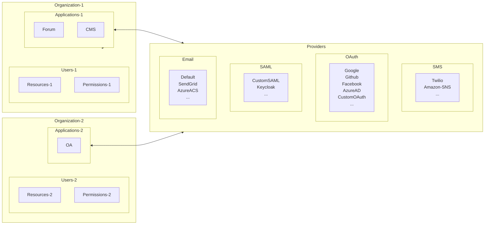

Think of Casdoor as a toolkit for authentication. To use it effectively, you need to understand four core concepts that work together like pieces of a puzzle: **Organizations**, **Users**, **Applications**, and **Providers**. Once you grasp these, everything else clicks into place.

Let's see how they connect:



:::tip Follow Along

We'll use the demo site at <https://door.casdoor.com> throughout this guide. Feel free to explore it as you read!

:::

## 🏢 Organization: Your Container for Everything

An **organization** is like a workspace that groups related users and applications together. Think of it as:

- **For a company**: All your employees
- **For a SaaS product**: All your customers  
- **For a multi-tenant app**: Each tenant gets their own organization

### Why Organizations Matter

Organizations keep things separate and secure. Users in `company-a` can't accidentally access applications in `company-b`. It's perfect for:

- **Multi-tenancy**: Each client gets their own isolated space
- **Departmental separation**: HR, Engineering, and Sales can have their own orgs
- **Brand customization**: Each org can have its own look and feel

### What's Inside an Organization?

Let's peek under the hood. Here's the data structure (don't worry if you're not a programmer - the table below explains what matters):

```go
type Organization struct {
    Owner       string `xorm:"varchar(100) notnull pk" json:"owner"`
    Name        string `xorm:"varchar(100) notnull pk" json:"name"`
    CreatedTime string `xorm:"varchar(100)" json:"createdTime"`

    DisplayName        string   `xorm:"varchar(100)" json:"displayName"`
    WebsiteUrl         string   `xorm:"varchar(100)" json:"websiteUrl"`
    Favicon            string   `xorm:"varchar(100)" json:"favicon"`
    PasswordType       string   `xorm:"varchar(100)" json:"passwordType"`
    PasswordSalt       string   `xorm:"varchar(100)" json:"passwordSalt"`
    PhonePrefix        string   `xorm:"varchar(10)"  json:"phonePrefix"`
    DefaultAvatar      string   `xorm:"varchar(100)" json:"defaultAvatar"`
    Tags               []string `xorm:"mediumtext" json:"tags"`
    MasterPassword     string   `xorm:"varchar(100)" json:"masterPassword"`
    EnableSoftDeletion bool     `json:"enableSoftDeletion"`
    IsProfilePublic    bool     `json:"isProfilePublic"`

    AccountItems []*AccountItem `xorm:"varchar(2000)" json:"accountItems"`
}
```

**Key Fields Explained:**

| Field | What It Does | Example |
|-------|-------------|---------|
| `DisplayName` | The friendly name shown to users | "Acme Corporation" |
| `WebsiteUrl` | Your organization's website | "<https://acme.com>" |
| `Favicon` | Custom icon for login pages | Your company logo |
| `PasswordType` | How passwords are hashed | bcrypt, argon2, etc. |
| `EnableSoftDeletion` | Deleted users go to trash instead of being permanently removed | Useful for compliance |
| `AccountItems` | Custom fields for user profiles | Employee ID, Department, etc. |

## 👤 User: The People in Your System

**Users** are the people who log in. Simple, right? In Casdoor, every user belongs to exactly one organization but can access multiple applications within that org.

### Two Types of Users

Casdoor has a special hierarchy:

1. **🔧 Platform Administrators** (`built-in/admin`)
   - Lives in the special `built-in` organization
   - Has god-mode access to everything
   - Manages Casdoor itself

2. **🙋 Regular Users** (`my-company/alice`)
   - Belong to your organizations
   - Can sign up, sign in, and manage their own profiles
   - Access applications based on permissions

### User Identifiers

Users are identified by a format: `<organization>/<username>`. For example:

- `built-in/admin` - The default Casdoor administrator
- `acme-corp/john` - John from Acme Corporation  
- `startup-inc/sarah` - Sarah from Startup Inc

Each user also gets a unique UUID (like `d835a48f-2e88-4c1f-b907-60ac6b6c1b40`) which you can use as a stable identifier in your application.

:::tip Simplify for Single-Org Apps

If your application only serves one organization, you can use just the username (e.g., `alice`) instead of the full identifier (`my-company/alice`). Much cleaner!

:::

### The User Data Structure

```go
type User struct {
    Owner       string `xorm:"varchar(100) notnull pk" json:"owner"`
    Name        string `xorm:"varchar(100) notnull pk" json:"name"`
    CreatedTime string `xorm:"varchar(100)" json:"createdTime"`
    UpdatedTime string `xorm:"varchar(100)" json:"updatedTime"`

    Id                string   `xorm:"varchar(100)" json:"id"`
    Type              string   `xorm:"varchar(100)" json:"type"`
    Password          string   `xorm:"varchar(100)" json:"password"`
    PasswordSalt      string   `xorm:"varchar(100)" json:"passwordSalt"`
    DisplayName       string   `xorm:"varchar(100)" json:"displayName"`
    Avatar            string   `xorm:"varchar(500)" json:"avatar"`
    PermanentAvatar   string   `xorm:"varchar(500)" json:"permanentAvatar"`
    Email             string   `xorm:"varchar(100) index" json:"email"`
    Phone             string   `xorm:"varchar(100) index" json:"phone"`
    Location          string   `xorm:"varchar(100)" json:"location"`
    Address           []string `json:"address"`
    Affiliation       string   `xorm:"varchar(100)" json:"affiliation"`
    Title             string   `xorm:"varchar(100)" json:"title"`
    IdCardType        string   `xorm:"varchar(100)" json:"idCardType"`
    IdCard            string   `xorm:"varchar(100) index" json:"idCard"`
    Homepage          string   `xorm:"varchar(100)" json:"homepage"`
    Bio               string   `xorm:"varchar(100)" json:"bio"`
    Tag               string   `xorm:"varchar(100)" json:"tag"`
    Region            string   `xorm:"varchar(100)" json:"region"`
    Language          string   `xorm:"varchar(100)" json:"language"`
    Gender            string   `xorm:"varchar(100)" json:"gender"`
    Birthday          string   `xorm:"varchar(100)" json:"birthday"`
    Education         string   `xorm:"varchar(100)" json:"education"`
    Score             int      `json:"score"`
    Ranking           int      `json:"ranking"`
    IsDefaultAvatar   bool     `json:"isDefaultAvatar"`
    IsOnline          bool     `json:"isOnline"`
    IsAdmin           bool     `json:"isAdmin"`
    IsGlobalAdmin     bool     `json:"isGlobalAdmin"`
    IsForbidden       bool     `json:"isForbidden"`
    IsDeleted         bool     `json:"isDeleted"`
    SignupApplication string   `xorm:"varchar(100)" json:"signupApplication"`
    Hash              string   `xorm:"varchar(100)" json:"hash"`
    PreHash           string   `xorm:"varchar(100)" json:"preHash"`

    CreatedIp      string `xorm:"varchar(100)" json:"createdIp"`
    LastSigninTime string `xorm:"varchar(100)" json:"lastSigninTime"`
    LastSigninIp   string `xorm:"varchar(100)" json:"lastSigninIp"`

    Github   string `xorm:"varchar(100)" json:"github"`
    Google   string `xorm:"varchar(100)" json:"google"`
    QQ       string `xorm:"qq varchar(100)" json:"qq"`
    WeChat   string `xorm:"wechat varchar(100)" json:"wechat"`
    Facebook string `xorm:"facebook varchar(100)" json:"facebook"`
    DingTalk string `xorm:"dingtalk varchar(100)" json:"dingtalk"`
    Weibo    string `xorm:"weibo varchar(100)" json:"weibo"`
    Gitee    string `xorm:"gitee varchar(100)" json:"gitee"`
    LinkedIn string `xorm:"linkedin varchar(100)" json:"linkedin"`
    Wecom    string `xorm:"wecom varchar(100)" json:"wecom"`
    Lark     string `xorm:"lark varchar(100)" json:"lark"`
    Gitlab   string `xorm:"gitlab varchar(100)" json:"gitlab"`
    Apple    string `xorm:"apple varchar(100)" json:"apple"`
    AzureAD  string `xorm:"azuread varchar(100)" json:"azuread"`
    Slack    string `xorm:"slack varchar(100)" json:"slack"`

    Ldap       string            `xorm:"ldap varchar(100)" json:"ldap"`
    Properties map[string]string `json:"properties"`
}
```

**What All These Fields Mean:**

- **Basic Info**: Name, email, phone, avatar - the usual suspects
- **Profile Details**: Bio, location, birthday, education - make profiles rich
- **Security Tracking**: Login times, IP addresses, forbidden status - know what's happening  
- **Social Connections**: GitHub, Google, WeChat, etc. - linked accounts from OAuth providers
- **Admin Flags**: `IsAdmin`, `IsGlobalAdmin` - permission levels at a glance
- **Custom Data**: The `Properties` field - your escape hatch for extra data!

:::tip Custom User Properties

Need to store custom fields like "Employee ID" or "Department"? Use the `Properties` field - it's a flexible key-value map for any extra data. Check out the [User Properties documentation](/docs/user/overview#using-the-properties-field) for examples.

:::

## 📱 Application: What Users Access

An **application** represents any web service or app that needs authentication. This could be:

- 🗨️ A forum (like Casnode)
- 📊 An office automation (OA) system  
- 💼 A CRM platform
- 🛍️ An e-commerce site
- 🎮 A gaming portal

Each application is essentially a "door" that users walk through to access your service. When users log in, they're logging in through a specific application.

### Application Structure

```go
type Application struct {
    Owner               string          `xorm:"varchar(100) notnull pk" json:"owner"`
    Name                string          `xorm:"varchar(100) notnull pk" json:"name"`
    CreatedTime         string          `xorm:"varchar(100)" json:"createdTime"`
    DisplayName         string          `xorm:"varchar(100)" json:"displayName"`
    Logo                string          `xorm:"varchar(100)" json:"logo"`
    HomepageUrl         string          `xorm:"varchar(100)" json:"homepageUrl"`
    Description         string          `xorm:"varchar(100)" json:"description"`
    Organization        string          `xorm:"varchar(100)" json:"organization"`
    Cert                string          `xorm:"varchar(100)" json:"cert"`
    EnablePassword      bool            `json:"enablePassword"`
    EnableSignUp        bool            `json:"enableSignUp"`
    EnableSigninSession bool            `json:"enableSigninSession"`
    EnableCodeSignin    bool            `json:"enableCodeSignin"`
    Providers           []*ProviderItem `xorm:"mediumtext" json:"providers"`
    SignupItems         []*SignupItem   `xorm:"varchar(1000)" json:"signupItems"`
    OrganizationObj     *Organization   `xorm:"-" json:"organizationObj"`
    ClientId             string         `xorm:"varchar(100)" json:"clientId"`
    ClientSecret         string         `xorm:"varchar(100)" json:"clientSecret"`
    RedirectUris         []string       `xorm:"varchar(1000)" json:"redirectUris"`
    TokenFormat          string         `xorm:"varchar(100)" json:"tokenFormat"`
    ExpireInHours        int            `json:"expireInHours"`
    RefreshExpireInHours int            `json:"refreshExpireInHours"`
    SignupUrl            string         `xorm:"varchar(200)" json:"signupUrl"`
    SigninUrl            string         `xorm:"varchar(200)" json:"signinUrl"`
    ForgetUrl            string         `xorm:"varchar(200)" json:"forgetUrl"`
    AffiliationUrl       string         `xorm:"varchar(100)" json:"affiliationUrl"`
    TermsOfUse           string         `xorm:"varchar(100)" json:"termsOfUse"`
    SignupHtml           string         `xorm:"mediumtext" json:"signupHtml"`
    SigninHtml           string         `xorm:"mediumtext" json:"signinHtml"`
}
```

**Key Features of Applications:**

- **OAuth Credentials**: Each app gets `ClientId` and `ClientSecret` for secure API calls
- **Custom Pages**: You can fully customize signup, signin, and password recovery pages
- **Flexible Auth**: Toggle password login, code-based signin, or social providers
- **Token Control**: Set token expiration times that fit your security requirements

### Applications are Entry Points

Think of an application as the front door. Users must enter through an application's login page to access Casdoor. Here are some examples from the demo site:

| Application | Sign-up Page | Sign-in Page |
|-------------|-------------|--------------|
| **app-built-in** | [door.casdoor.com/signup](https://door.casdoor.com/signup) | [door.casdoor.com/login](https://door.casdoor.com/login) |
| **app-casnode** | [door.casdoor.com/signup/app-casnode](https://door.casdoor.com/signup/app-casnode) | OAuth flow with client_id |
| **app-casbin-oa** | [door.casdoor.com/signup/app-casbin-oa](https://door.casdoor.com/signup/app-casbin-oa) | OAuth flow with client_id |

### Building Login URLs

You'll need to construct URLs for signup and signin. Here are three ways to do it:

#### Option 1: Manual URL Construction

Build URLs yourself using this pattern:

**For Sign-up:**

- Standard signup: `<casdoor-url>/signup/<app-name>`
- OAuth signup: `<casdoor-url>/signup/oauth/authorize?client_id=xxx&response_type=code&redirect_uri=xxx&scope=read&state=casdoor`
- Auto-signup: `<casdoor-url>/auto-signup/oauth/authorize?client_id=xxx&response_type=code&redirect_uri=xxx&scope=read&state=casdoor`

**For Sign-in:**

- Organization signin: `<casdoor-url>/login/<org-name>`
- OAuth signin: `<casdoor-url>/login/oauth/authorize?client_id=xxx&response_type=code&redirect_uri=xxx&scope=read&state=casdoor`

#### Option 2: Use Frontend SDK

For JavaScript/React/Vue/Angular applications, use helper functions:

```javascript
import { getSignupUrl, getSigninUrl } from 'casdoor-js-sdk';

const signupUrl = getSignupUrl();
const signinUrl = getSigninUrl();
```

See the [casdoor-js-sdk documentation](https://github.com/casdoor/casdoor-js-sdk/blob/3d08d726bcd5f62d6444b820596e2d8472f67d97/src/sdk.ts#L50-L63) for details.

#### Option 3: Use Backend SDK

For server-side code in Go, Java, Python, etc.:

```go
import "github.com/casdoor/casdoor-go-sdk/auth"

signupUrl := auth.GetSignupUrl()
signinUrl := auth.GetSigninUrl()
```

See the [casdoor-go-sdk documentation](https://github.com/casdoor/casdoor-go-sdk/blob/f3ef1adff792e9a06af5682e0a3af9436ed24ed3/auth/url.go#L23-L39) for details.

## 🔌 Provider: Connecting External Services

**Providers** are like plugins that connect Casdoor to external services. Need to send verification emails? Use an email provider. Want users to log in with GitHub? Add an OAuth provider.

Casdoor supports providers for:

- **🔐 OAuth/OIDC/SAML**: Social login (Google, GitHub, Facebook, etc.)
- **📧 Email**: SendGrid, Azure ACS, SMTP, and more
- **📱 SMS**: Twilio, Amazon SNS, Alibaba Cloud, etc.
- **☁️ Storage**: AWS S3, Azure Blob, Aliyun OSS for file uploads
- **💳 Payment**: Stripe, PayPal, Alipay for subscription handling

See the complete list at [Provider Overview](/docs/provider/overview).

### Provider Structure

```go
type Provider struct {
    Owner       string `xorm:"varchar(100) notnull pk" json:"owner"`
    Name        string `xorm:"varchar(100) notnull pk" json:"name"`
    CreatedTime string `xorm:"varchar(100)" json:"createdTime"`

    DisplayName   string `xorm:"varchar(100)" json:"displayName"`
    Category      string `xorm:"varchar(100)" json:"category"`
    Type          string `xorm:"varchar(100)" json:"type"`
    Method        string `xorm:"varchar(100)" json:"method"`
    ClientId      string `xorm:"varchar(100)" json:"clientId"`
    ClientSecret  string `xorm:"varchar(100)" json:"clientSecret"`
    ClientId2     string `xorm:"varchar(100)" json:"clientId2"`
    ClientSecret2 string `xorm:"varchar(100)" json:"clientSecret2"`

    Host    string `xorm:"varchar(100)" json:"host"`
    Port    int    `json:"port"`
    Title   string `xorm:"varchar(100)" json:"title"`
    Content string `xorm:"varchar(1000)" json:"content"`

    RegionId     string `xorm:"varchar(100)" json:"regionId"`
    SignName     string `xorm:"varchar(100)" json:"signName"`
    TemplateCode string `xorm:"varchar(100)" json:"templateCode"`
    AppId        string `xorm:"varchar(100)" json:"appId"`

    Endpoint         string `xorm:"varchar(1000)" json:"endpoint"`
    IntranetEndpoint string `xorm:"varchar(100)" json:"intranetEndpoint"`
    Domain           string `xorm:"varchar(100)" json:"domain"`
    Bucket           string `xorm:"varchar(100)" json:"bucket"`

    Metadata               string `xorm:"mediumtext" json:"metadata"`
    IdP                    string `xorm:"mediumtext" json:"idP"`
    IssuerUrl              string `xorm:"varchar(100)" json:"issuerUrl"`
    EnableSignAuthnRequest bool   `json:"enableSignAuthnRequest"`

    ProviderUrl string `xorm:"varchar(200)" json:"providerUrl"`
}
```

**Providers are Flexible:**

The Provider struct has many fields because it needs to support dozens of different services. Depending on the `Category` and `Type`:

- **OAuth providers** use `ClientId` and `ClientSecret`
- **Email providers** use `Host`, `Port`, and credentials
- **SMS providers** use `AppId`, `SignName`, and `TemplateCode`
- **Storage providers** use `Endpoint`, `Bucket`, and access keys

Don't be intimidated - you only fill in the fields relevant to your specific provider type!

## 🎯 How Casdoor Manages Itself

When you first start Casdoor, it creates some special "built-in" objects to bootstrap itself:

### The Built-in Organization

- **Name**: `built-in`
- **Purpose**: Houses Casdoor's administrators
- **Special Power**: All users in this org have god-mode access to the entire platform

### The Default Admin User

- **Username**: `built-in/admin`
- **Default Password**: `123` (⚠️ change this immediately!)
- **Access**: Full control over Casdoor

### The Built-in Application

- **Name**: `app-built-in`
- **Purpose**: Represents Casdoor's own admin interface
- **Access URL**: The root path (e.g., `https://door.casdoor.com`)

### Adding More Administrators

Want to add more admins? Simply create new users under the `built-in` organization. Each one will automatically have full administrative privileges.

:::caution Don't Delete Built-in Objects!

The `built-in` organization, admin user, and app-built-in application are hardcoded into Casdoor's core. **Never** try to:

- Rename them
- Delete them
- Modify them directly in the database

Doing so will break your entire Casdoor installation. These objects are sacred - treat them with respect!

:::

## 🎓 Putting It All Together

Let's recap how everything connects:

1. **Organizations** contain **Users** and **Applications**
2. **Users** belong to one **Organization** but can access multiple **Applications**
3. **Applications** use **Providers** for authentication methods (social login, email, SMS)
4. **Providers** connect Casdoor to external services

Here's a real-world scenario:

```text
Acme Corporation (Organization)
├── Users: alice, bob, charlie
├── Applications
│   ├── Employee Portal (for internal staff)
│   ├── Customer Dashboard (for clients)
│   └── Admin Panel (for IT team)
└── Providers
    ├── Google OAuth (for social login)
    ├── SendGrid (for email verification)
    └── Twilio (for SMS 2FA)
```

When Alice logs into the Employee Portal:

1. She visits the app's login URL
2. Chooses to sign in with Google (an OAuth provider)
3. Google authenticates her and returns to Casdoor
4. Casdoor creates/updates her user record in Acme Corp organization
5. She gets access to the Employee Portal!

## Next Steps

Now that you understand the core concepts, you're ready to:

- **[Try Casdoor with Docker](/docs/basic/try-with-docker)** - Get hands-on experience
- **[Configure Your First Application](/docs/application/overview)** - Set up authentication
- **[Add Providers](/docs/provider/overview)** - Enable social login and notifications
- **[Manage Users](/docs/user/overview)** - Learn about user management

Questions? Head to our [Discord community](https://discord.gg/5rPsrAzK7S) where fellow Casdoor users and maintainers are ready to help!
