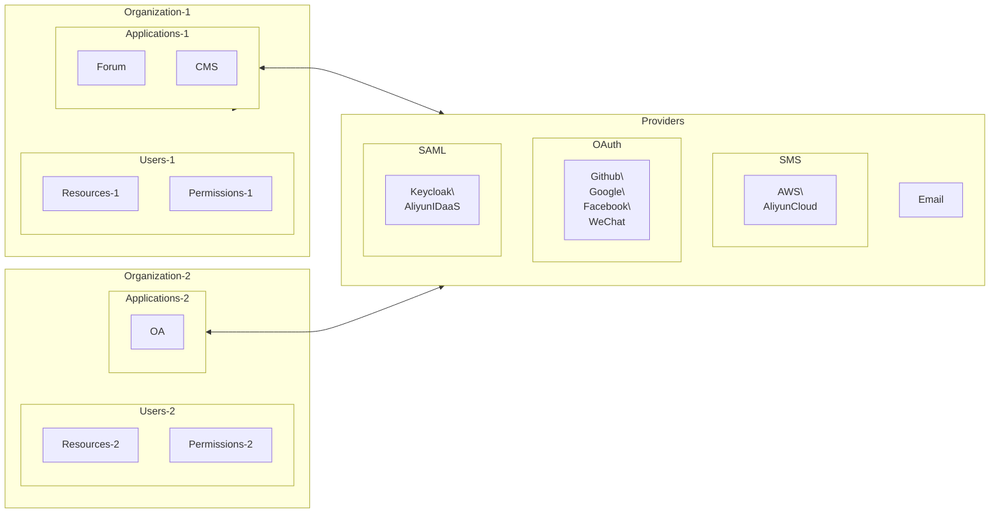

As Casdoor's administrator, you should get familiar with at least 4 core concepts: `Organization`, `User`, `Application` and `Provider`.



:::tip

In the following parts, we will use the demo site: https://door.casdoor.com as example.

:::

## Organization

In Casdoor, an organization is a container for users and applications. E.g., all the employees of a company or all the customers of a business can be abstracted as one organization. The Organization class definition is shown as follows:

```go
type Organization struct {
	Owner       string `xorm:"varchar(100) notnull pk" json:"owner"`
	Name        string `xorm:"varchar(100) notnull pk" json:"name"`
	CreatedTime string `xorm:"varchar(100)" json:"createdTime"`

	DisplayName        string `xorm:"varchar(100)" json:"displayName"`
	WebsiteUrl         string `xorm:"varchar(100)" json:"websiteUrl"`
	Favicon            string `xorm:"varchar(100)" json:"favicon"`
	PasswordType       string `xorm:"varchar(100)" json:"passwordType"`
	PasswordSalt       string `xorm:"varchar(100)" json:"passwordSalt"`
	PhonePrefix        string `xorm:"varchar(10)"  json:"phonePrefix"`
	DefaultAvatar      string `xorm:"varchar(100)" json:"defaultAvatar"`
	MasterPassword     string `xorm:"varchar(100)" json:"masterPassword"`
	EnableSoftDeletion bool   `json:"enableSoftDeletion"`
}
```

## User

A user in Casdoor can log into an application. One user can only belong to one organization, but can have the ability to log into multiple applications that owned by the organization. Currently there are two types of users in Casdoor:

- Users under `built-in` organization, like `built-in/admin`: the global administrators, have the full administrator power on the Casdoor platform.
- Users under other organizations, like `my-company/alice`: normal users, can only sign up, sign in, sign out, change his/her own profile, etc.

In Casdoor API, a user is usually identified as `<organization_name>/<username>`, e.g., the default administrator of Casdoor is denoted as `built-in/admin`. There is also a property in user called `id`, which is a UUID like `d835a48f-2e88-4c1f-b907-60ac6b6c1b40`, it can also be chosen as a ID for a user by an application.

:::tip

If your application is only for one organization, you can just use `<username>` instead of `<organization_name>/<username>` as user ID across your application for simplicity.

:::

The User class definition is shown as follows:

```go
type User struct {
	Owner       string `xorm:"varchar(100) notnull pk" json:"owner"`
	Name        string `xorm:"varchar(100) notnull pk" json:"name"`
	CreatedTime string `xorm:"varchar(100)" json:"createdTime"`
	UpdatedTime string `xorm:"varchar(100)" json:"updatedTime"`

	Id                string   `xorm:"varchar(100)" json:"id"`
	Type              string   `xorm:"varchar(100)" json:"type"`
	Password          string   `xorm:"varchar(100)" json:"password"`
	PasswordSalt      string   `xorm:"varchar(100)" json:"passwordSalt"`
	DisplayName       string   `xorm:"varchar(100)" json:"displayName"`
	Avatar            string   `xorm:"varchar(500)" json:"avatar"`
	PermanentAvatar   string   `xorm:"varchar(500)" json:"permanentAvatar"`
	Email             string   `xorm:"varchar(100) index" json:"email"`
	Phone             string   `xorm:"varchar(100) index" json:"phone"`
	Location          string   `xorm:"varchar(100)" json:"location"`
	Address           []string `json:"address"`
	Affiliation       string   `xorm:"varchar(100)" json:"affiliation"`
	Title             string   `xorm:"varchar(100)" json:"title"`
	IdCardType        string   `xorm:"varchar(100)" json:"idCardType"`
	IdCard            string   `xorm:"varchar(100) index" json:"idCard"`
	Homepage          string   `xorm:"varchar(100)" json:"homepage"`
	Bio               string   `xorm:"varchar(100)" json:"bio"`
	Tag               string   `xorm:"varchar(100)" json:"tag"`
	Region            string   `xorm:"varchar(100)" json:"region"`
	Language          string   `xorm:"varchar(100)" json:"language"`
	Gender            string   `xorm:"varchar(100)" json:"gender"`
	Birthday          string   `xorm:"varchar(100)" json:"birthday"`
	Education         string   `xorm:"varchar(100)" json:"education"`
	Score             int      `json:"score"`
	Ranking           int      `json:"ranking"`
	IsDefaultAvatar   bool     `json:"isDefaultAvatar"`
	IsOnline          bool     `json:"isOnline"`
	IsAdmin           bool     `json:"isAdmin"`
	IsGlobalAdmin     bool     `json:"isGlobalAdmin"`
	IsForbidden       bool     `json:"isForbidden"`
	IsDeleted         bool     `json:"isDeleted"`
	SignupApplication string   `xorm:"varchar(100)" json:"signupApplication"`
	Hash              string   `xorm:"varchar(100)" json:"hash"`
	PreHash           string   `xorm:"varchar(100)" json:"preHash"`

	CreatedIp      string `xorm:"varchar(100)" json:"createdIp"`
	LastSigninTime string `xorm:"varchar(100)" json:"lastSigninTime"`
	LastSigninIp   string `xorm:"varchar(100)" json:"lastSigninIp"`

	Github   string `xorm:"varchar(100)" json:"github"`
	Google   string `xorm:"varchar(100)" json:"google"`
	QQ       string `xorm:"qq varchar(100)" json:"qq"`
	WeChat   string `xorm:"wechat varchar(100)" json:"wechat"`
	Facebook string `xorm:"facebook varchar(100)" json:"facebook"`
	DingTalk string `xorm:"dingtalk varchar(100)" json:"dingtalk"`
	Weibo    string `xorm:"weibo varchar(100)" json:"weibo"`
	Gitee    string `xorm:"gitee varchar(100)" json:"gitee"`
	LinkedIn string `xorm:"linkedin varchar(100)" json:"linkedin"`
	Wecom    string `xorm:"wecom varchar(100)" json:"wecom"`
	Lark     string `xorm:"lark varchar(100)" json:"lark"`
	Gitlab   string `xorm:"gitlab varchar(100)" json:"gitlab"`
	Apple    string `xorm:"apple varchar(100)" json:"apple"`
	AzureAD  string `xorm:"azuread varchar(100)" json:"azuread"`
	Slack    string `xorm:"slack varchar(100)" json:"slack"`

	Ldap       string            `xorm:"ldap varchar(100)" json:"ldap"`
	Properties map[string]string `json:"properties"`
}
```

## Application

An application represents a web service that needs to be protected by Casdoor. E.g., a forum site, an OA system, a CRM system are all applications.

```go
type Application struct {
	Owner       string `xorm:"varchar(100) notnull pk" json:"owner"`
	Name        string `xorm:"varchar(100) notnull pk" json:"name"`
	CreatedTime string `xorm:"varchar(100)" json:"createdTime"`

	DisplayName         string          `xorm:"varchar(100)" json:"displayName"`
	Logo                string          `xorm:"varchar(100)" json:"logo"`
	HomepageUrl         string          `xorm:"varchar(100)" json:"homepageUrl"`
	Description         string          `xorm:"varchar(100)" json:"description"`
	Organization        string          `xorm:"varchar(100)" json:"organization"`
	Cert                string          `xorm:"varchar(100)" json:"cert"`
	EnablePassword      bool            `json:"enablePassword"`
	EnableSignUp        bool            `json:"enableSignUp"`
	EnableSigninSession bool            `json:"enableSigninSession"`
	EnableCodeSignin    bool            `json:"enableCodeSignin"`
	Providers           []*ProviderItem `xorm:"mediumtext" json:"providers"`
	SignupItems         []*SignupItem   `xorm:"varchar(1000)" json:"signupItems"`
	OrganizationObj     *Organization   `xorm:"-" json:"organizationObj"`

	ClientId             string   `xorm:"varchar(100)" json:"clientId"`
	ClientSecret         string   `xorm:"varchar(100)" json:"clientSecret"`
	RedirectUris         []string `xorm:"varchar(1000)" json:"redirectUris"`
	TokenFormat          string   `xorm:"varchar(100)" json:"tokenFormat"`
	ExpireInHours        int      `json:"expireInHours"`
	RefreshExpireInHours int      `json:"refreshExpireInHours"`
	SignupUrl            string   `xorm:"varchar(200)" json:"signupUrl"`
	SigninUrl            string   `xorm:"varchar(200)" json:"signinUrl"`
	ForgetUrl            string   `xorm:"varchar(200)" json:"forgetUrl"`
	AffiliationUrl       string   `xorm:"varchar(100)" json:"affiliationUrl"`
	TermsOfUse           string   `xorm:"varchar(100)" json:"termsOfUse"`
	SignupHtml           string   `xorm:"mediumtext" json:"signupHtml"`
	SigninHtml           string   `xorm:"mediumtext" json:"signinHtml"`
}
```

Each application can have its own customized sign up page, sign in page, etc. E.g., the root login page `/login` (like: https://door.casdoor.com/login) is the sign in page only for Casdoor's built-in application: `app-built-in`.

An application is a "portal" or "interface" for a user to log into Casdoor. A user must go through one application's sign in page to log into Casdoor.

| Application   | Sign up page URL                             | Sign in page URL                                                                                                                                                     |
|---------------|----------------------------------------------|----------------------------------------------------------------------------------------------------------------------------------------------------------------------|
| app-built-in  | https://door.casdoor.com/signup               | https://door.casdoor.com/login                                                                                                                                        |
| app-casnode   | https://door.casdoor.com/signup/app-casnode   | https://door.casdoor.com/login/oauth/authorize?client_id=014ae4bd048734ca2dea&response_type=code&redirect_uri=http://localhost:9000/callback&scope=read&state=casdoor |
| app-casbin-oa | https://door.casdoor.com/signup/app-casbin-oa | https://door.casdoor.com/login/oauth/authorize?client_id=0ba528121ea87b3eb54d&response_type=code&redirect_uri=http://localhost:9000/callback&scope=read&state=casdoor |

### Login URLs

It's very easy to log into Casdoor via Casdoor's built-in application, just visit Casdoor server's homepage (like: https://door.casdoor.com for demo site) and it will automatically redirect you to `/login`. But how to get these URLs for other applications in frontend and backend code? You can either concatenate strings by yourself or call some utility functions provided by Casdoor SDKs to get the URLs:

#### 1. By concatenating string manually:

- Sign up page URL: `<your-casdoor-hostname>/signup/<your-application-name>`
- Sign in page URL: `<your-casdoor-hostname>/login/oauth/authorize?client_id=<client-id-for-your-application>&response_type=code&redirect_uri=<redirect-uri-for-your-application>&&scope=read&state=casdoor `

#### 2. Use frontend SDK (for frontend Javascript code using React, Vue or Angular):

`getSignupUrl()` and `getSigninUrl()`: https://github.com/casdoor/casdoor-js-sdk/blob/3d08d726bcd5f62d6444b820596e2d8472f67d97/src/sdk.ts#L50-L63

#### 3. Use backend SDK (for backend code using Go, Java, etc.):

`GetSignupUrl()` and `GetSigninUrl()`: https://github.com/casdoor/casdoor-go-sdk/blob/f3ef1adff792e9a06af5682e0a3af9436ed24ed3/auth/url.go#L23-L39

## Provider

Casdoor is a federated single-sign-on system, which supports multiple identity providers via OIDC, OAuth and SAML. Casdoor can also send verification code or other notifications to users via Email or SMS (Short Message Service). Casdoor uses the concept: `Provider` to manage all these third-party connectors.

Currently, All providers supported by Casdoor can be found here: **[/docs/provider/overview](/docs/provider/overview)**

```go
type Provider struct {
	Owner       string `xorm:"varchar(100) notnull pk" json:"owner"`
	Name        string `xorm:"varchar(100) notnull pk" json:"name"`
	CreatedTime string `xorm:"varchar(100)" json:"createdTime"`

	DisplayName   string `xorm:"varchar(100)" json:"displayName"`
	Category      string `xorm:"varchar(100)" json:"category"`
	Type          string `xorm:"varchar(100)" json:"type"`
	Method        string `xorm:"varchar(100)" json:"method"`
	ClientId      string `xorm:"varchar(100)" json:"clientId"`
	ClientSecret  string `xorm:"varchar(100)" json:"clientSecret"`
	ClientId2     string `xorm:"varchar(100)" json:"clientId2"`
	ClientSecret2 string `xorm:"varchar(100)" json:"clientSecret2"`

	Host    string `xorm:"varchar(100)" json:"host"`
	Port    int    `json:"port"`
	Title   string `xorm:"varchar(100)" json:"title"`
	Content string `xorm:"varchar(1000)" json:"content"`

	RegionId     string `xorm:"varchar(100)" json:"regionId"`
	SignName     string `xorm:"varchar(100)" json:"signName"`
	TemplateCode string `xorm:"varchar(100)" json:"templateCode"`
	AppId        string `xorm:"varchar(100)" json:"appId"`

	Endpoint         string `xorm:"varchar(1000)" json:"endpoint"`
	IntranetEndpoint string `xorm:"varchar(100)" json:"intranetEndpoint"`
	Domain           string `xorm:"varchar(100)" json:"domain"`
	Bucket           string `xorm:"varchar(100)" json:"bucket"`

	Metadata               string `xorm:"mediumtext" json:"metadata"`
	IdP                    string `xorm:"mediumtext" json:"idP"`
	IssuerUrl              string `xorm:"varchar(100)" json:"issuerUrl"`
	EnableSignAuthnRequest bool   `json:"enableSignAuthnRequest"`

	ProviderUrl string `xorm:"varchar(200)" json:"providerUrl"`
}
```

## How does Casdoor manage itself?

When you run Casdoor for the first time, Casdoor will create some built-in objects to help the administrator to manage Casdoor itself:

- A built-in organization named `built-in`.
- A user named `admin` in the `built-in` organization.
- A built-in application named `app-built-in`, owned by the `built-in` organization, representing Casdoor itself (Casdoor is actually also an application).

All the users under `built-in` organization, including `admin` will have the full administrator power on the Casdoor platform by default. So if you have multiple administrators, then create new accounts under `built-in` organization. Otherwise, remember to close the sign up channel for the `app-built-in` application.

:::caution

The built-in objects are already forbidden to rename or delete in both web UI or RESTful API. Casdoor has hard-coded these reserved names in many places. Do not try to rename or delete them in any way like modifying the DB, otherwise the whole system may crash.

:::
