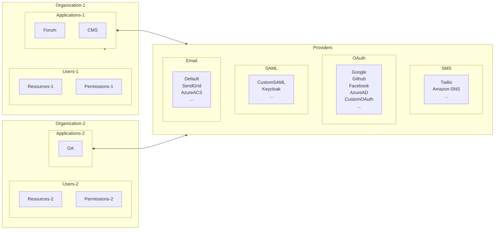

Casdoor has four core objects: organizations, users, applications, and providers. An organization contains users and applications. Users sign in through an application. An application uses providers to offer sign-in methods and to send messages.

```mermaid
flowchart LR;
    subgraph Organization-1;
        Applications-1;
        Users-1;
    end;
    
    subgraph Organization-2;
        Applications-2;
        Users-2;
    end;
    
    subgraph Users-1;
        Resources-1;
        Permissions-1;
    end;
    
    subgraph Users-2;
        Resources-2;
        Permissions-2;
    end;
    
    subgraph Providers;
        SMS;
        OAuth;
        SAML;
        Email;
    end;
    
    subgraph SMS;
        Twilio\nAmazon-SNS\n...;
    end;
    
    subgraph OAuth;
        Google\nGithub\nFacebook\nAzureAD\nCustomOAuth\n...;
    end;
    
    subgraph SAML;
        CustomSAML\nKeycloak\n...;
    end;
    
    subgraph Email;
        Default\nSendGrid\nAzureACS\n...;
    end;
    
    subgraph Applications-1;
        Forum;
        CMS;
    end;
    
    subgraph Applications-2;
        OA;
    end;
    
    Organization-1 --> Applications-1;
    Applications-1<-->Providers;
    Applications-2<-->Providers;
```

The examples on this page use the demo site `https://door.casdoor.com`.

## Organization

An organization is a container for users and applications. An organization typically stands for the employees of a company or the customers of a product. Several organizations can share one Casdoor instance, and each organization has its own users, applications, password rules, and branding.

| Property | Description |
|---|---|
| `owner` | Always `admin` for organizations |
| `name` | Unique name of the organization, for example `built-in` |
| `displayName` | Name shown in the UI |
| `websiteUrl` | Website of the organization |
| `passwordType` | Algorithm used to store the passwords of the organization's users |
| `defaultAvatar` | Avatar given to new users |
| `enableSoftDeletion` | Marks deleted users as deleted but keeps them in the database |
| `accountItems` | Fields shown on the account page of a user, and who can view and edit them |

For all settings of an organization, see [Organizations](/docs/organization/overview).

## User

A user is an account that can sign in. Each user belongs to exactly one organization and can sign in to every application of that organization.

Casdoor has two kinds of users:

- **Users of the `built-in` organization**, such as `built-in/admin`: Global administrators with full control over the Casdoor instance.
- **Users of other organizations**, such as `my-company/alice`: Regular users who can sign up, sign in, sign out, and manage their own profile.

### User IDs

A user has two identifiers:

| Identifier | Example | Use it for |
|---|---|---|
| `<organization>/<username>` | `built-in/admin` | Calls to the Casdoor API |
| `id` | `d835a48f-2e88-4c1f-b907-60ac6b6c1b40` | A stable user ID in your own application. It is a UUID |

:::tip
If your application uses one organization only, you can use `<username>` alone as the user ID in your application.
:::

### User properties

| Property | Description |
|---|---|
| `owner` | Name of the organization that the user belongs to |
| `name` | Username, unique within the organization |
| `id` | UUID of the user |
| `displayName` | Name shown in the UI |
| `avatar` | URL of the avatar image |
| `email`, `phone` | Contact details, also used for verification codes |
| `password` | Password, stored in the form that the organization's `passwordType` defines |
| `isAdmin` | Whether the user is an administrator of the organization |
| `isForbidden` | Whether the user is blocked from signing in |
| `isDeleted` | Whether the user is soft-deleted |
| `signupApplication` | Application through which the user signed up |
| `github`, `google`, `wechat`, and so on | ID of the user at each linked identity provider |
| `ldap` | ID of the user in the LDAP directory that the user was synchronized from |
| `properties` | Key-value map for your own attributes |

Use `properties` for attributes that Casdoor has no field for. See [Using the Properties field](/docs/user/overview#using-the-properties-field). For the full list of fields, see [Users](/docs/user/overview).

## Application

An application is a web service that signs users in with Casdoor, for example a forum, an internal office system, or a customer relationship management system. An application belongs to one organization and holds the settings for how users of that organization sign in to it.

| Property | Description |
|---|---|
| `owner` | Always `admin` for applications |
| `name` | Unique name of the application, for example `app-built-in` |
| `organization` | Organization whose users can sign in to the application |
| `clientId`, `clientSecret` | OAuth 2.0 credentials of the application |
| `redirectUris` | URLs that Casdoor may send users back to after sign-in |
| `providers` | Providers that the application offers on its sign-in and sign-up pages |
| `signupItems` | Fields of the sign-up page |
| `enablePassword` | Whether users can sign in with a password |
| `enableSignUp` | Whether new users can sign up |
| `tokenFormat` | Format of the access tokens that Casdoor issues for the application |
| `expireInHours`, `refreshExpireInHours` | Lifetime of access tokens and refresh tokens |
| `cert` | Certificate that signs the tokens |

For all settings of an application, see [Application configuration](/docs/application/config).

### Sign-in and sign-up pages

Users always sign in through an application. Each application has its own sign-in and sign-up pages. The root path `/login` is the sign-in page of `app-built-in`, the application that Casdoor creates for its own admin console.

| Application | Sign-up page | Sign-in page |
|---|---|---|
| `app-built-in` | `https://door.casdoor.com/signup` | `https://door.casdoor.com/login` |
| `app-casnode` | `https://door.casdoor.com/signup/app-casnode` | `https://door.casdoor.com/login/oauth/authorize?client_id=014ae4bd048734ca2dea&response_type=code&redirect_uri=http://localhost:9000/callback&scope=read&state=casdoor` |
| `app-casbin-oa` | `https://door.casdoor.com/signup/app-casbin-oa` | `https://door.casdoor.com/login/oauth/authorize?client_id=0ba528121ea87b3eb54d&response_type=code&redirect_uri=http://localhost:9000/callback&scope=read&state=casdoor` |

### Sign-in and sign-up URLs {#login-urls}

To send users to the pages of your own application, build the URLs yourself or let an SDK build them.

#### Build the URLs yourself

| Page | URL |
|---|---|
| Sign-up page of an application | `<casdoor-host>/signup/<application-name>` |
| Sign-up page that continues with OAuth 2.0 | `<casdoor-host>/signup/oauth/authorize?client_id=<client-id>&response_type=code&redirect_uri=<redirect-uri>&scope=read&state=<state>` |
| Sign-in page of an organization | `<casdoor-host>/login/<organization-name>` |
| Sign-in page that continues with OAuth 2.0 | `<casdoor-host>/login/oauth/authorize?client_id=<client-id>&response_type=code&redirect_uri=<redirect-uri>&scope=read&state=<state>` |

#### Use a frontend SDK

In React, Vue, and Angular applications, call `getSignupUrl()` and `getSigninUrl()` of [casdoor-js-sdk](https://github.com/casdoor/casdoor-js-sdk/blob/3d08d726bcd5f62d6444b820596e2d8472f67d97/src/sdk.ts#L50-L63).

#### Use a backend SDK

In Go, Java, and other backends, call the equivalent functions of the SDK, for example `GetSignupUrl()` and `GetSigninUrl()` of [casdoor-go-sdk](https://github.com/casdoor/casdoor-go-sdk/blob/f3ef1adff792e9a06af5682e0a3af9436ed24ed3/auth/url.go#L23-L39).

## Provider

A provider connects Casdoor to an external service. Casdoor federates sign-in to external identity providers over OAuth 2.0, OpenID Connect (OIDC), and SAML. It also uses external services to send email and SMS, store files, show captchas, and take payments. Each of these connections is a provider.

You create a provider once and then add it to the applications that use it.

| Property | Description |
|---|---|
| `owner` | `admin` for a provider that all organizations share, or the name of the organization that owns it |
| `name` | Unique name of the provider |
| `category` | Kind of provider, for example `OAuth`, `SAML`, `Email`, `SMS`, `Storage`, `Captcha`, or `Payment` |
| `type` | Service behind the provider, for example `GitHub`, `Google`, or `Twilio SMS` |
| `clientId`, `clientSecret` | Credentials that the external service issues to Casdoor |
| `host`, `port` | Server address, for example of an SMTP server |
| `endpoint`, `bucket`, `domain` | Location settings of storage providers |
| `metadata`, `issuerUrl` | Settings of SAML identity providers |

For every provider category and type, see [Providers](/docs/provider/overview).

## Built-in objects {#how-casdoor-manages-itself}

Casdoor manages itself with the same four objects. On first start, it creates:

| Object | Name | Purpose |
|---|---|---|
| Organization | `built-in` | Holds the administrators of the Casdoor instance |
| User | `built-in/admin` | First global administrator |
| Application | `app-built-in` | The Casdoor admin console itself |

Every user of the `built-in` organization is a global administrator. To add administrators, create more users in `built-in`. To keep strangers from becoming administrators, turn off sign-up for `app-built-in`.

:::caution
You can't rename or delete the `built-in` organization, the `built-in/admin` user, or the `app-built-in` application in the admin console or through the API. Their names are hardcoded. Changing or removing them in the database can break Casdoor.
:::

## See also

- [Organizations](/docs/organization/overview)
- [Users](/docs/user/overview)
- [Applications](/docs/application/overview)
- [Providers](/docs/provider/overview)
