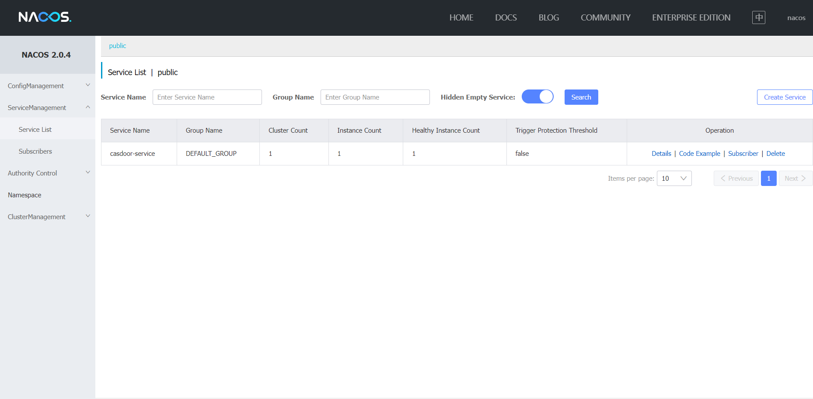

[casdoor-spring-boot-example](https://github.com/casdoor/casdoor-spring-boot-example) is an example on how to use [casdoor-spring-boot-starter](https://github.com/casdoor/casdoor-spring-boot-starter) in SpringBoot project. We will show you the steps below.

## Step1. Deploy Casdoor

Firstly, the Casdoor should be deployed.

You can refer to the Casdoor official documentation for the [Server Installation](/docs/basic/server-installation). Please deploy your Casdoor instance in **production mode**.

After a successful deployment, you need to ensure:

- Open your favorite browser and visit **http://localhost:8000**, you will see the login page of Casdoor.
- Input `admin` and `123` to test login functionality is working fine.

Then you can quickly implement a casdoor based login page in your own app with the following steps.

## Step2. Import casdoor-spring-boot-starter

You can import the casdoor-spring-boot-starter with  maven or gradle.

```
<!-- https://mvnrepository.com/artifact/org.casbin/casdoor-spring-boot-starter -->
<dependency>
    <groupId>org.casbin</groupId>
    <artifactId>casdoor-spring-boot-starter</artifactId>
    <version>1.x.y</version>
</dependency>
```


```
// https://mvnrepository.com/artifact/org.casbin/casdoor-spring-boot-starter
implementation group: 'org.casbin', name: 'casdoor-spring-boot-starter', version: '1.x.y'
```


## Step3. Init Config

Initialization requires 6 parameters, which are all string type.

| Name (in order)  | Must | Description                                         |
|------------------|------|-----------------------------------------------------|
| endpoint         | Yes  | Casdoor Server Url, such as `http://localhost:8000` |
| clientId         | Yes  | Application.client_id                               |
| clientSecret     | Yes  | Application.client_secret                           |
| jwtPublicKey     | Yes  | The public key for the Casdoor application's cert   |
| organizationName | Yes  | Application.organization                            |
| applicationName  | No   | Application.name                                    |

You can use Java properties or YAML files to init as below.

```properties
casdoor.endpoint = http://localhost:8000
casdoor.clientId = <client-id>
casdoor.clientSecret = <client-secret>
casdoor.jwtSecret = <jwt-public-key>
casdoor.organizationName = built-in
casdoor.applicationName = app-built-in
```

```yaml
casdoor:
  endpoint: http://localhost:8000
  client-id: <client-id>
  client-secret: <client-secret>
  jwt-public-key: <jwt-public-key>
  organization-name: built-in
  application-name: app-built-in
```


:::caution

You should replace the configuration with your own Casdoor instance especially the `clientId`, `clientSecret` and the `jwtPublicKey`.

:::

## Step3. service discovery

- 什么是注册中心

  注册中心在微服务项目中扮演着非常重要的角色，是微服务架构中的纽带，类似于通讯录，它记录了服务和服务地址的映射关系。在分布式架构中，服务会注册到这里，当服务需要调用其它服务时，就到这里找到服务的地址，进行调用。

- 为什么要使用注册中心

  注册中心解决了服务发现的问题。在没有注册中心时候，服务间调用需要知道被调方的地址或者代理地址。当服务更换部署地址，就不得不修改调用当中指定的地址或者修改代理配置。而有了注册中心之后，每个服务在调用别人的时候只需要知道服务名称就好，继续地址都会通过注册中心同步过来。

- Nacos 注册中心

  Nacos是阿里巴巴开源的一个更易于构建云原生应用的动态服务发现、配置管理和服务管理平台。

###下载方式
- Download the installation package

  可以从https://github.com/alibaba/nacos/releases 下载nacos-server-$version.zip包。

- Windows下载解压后（.zip），进入nacos/bin目录下， 启动命令`startup.cmd -m standalone`
- Nacos提供了一个可视化的操作平台，启动服务端后，在浏览器中输入(http://localhost:8848/nacos (opens new window))就可以访问了，默认的用户名和密码都是nacos

###如何使用

1. Add the dependency

```
<dependency>
	<groupId>com.alibaba.cloud</groupId>
	<artifactId>spring-cloud-starter-alibaba-nacos-discovery</artifactId>
</dependency>
```

2. add Nacos config

```
spring:
  application:
# 应用名称
    name: casdoor-service
  cloud:
    nacos:
      discovery:
# 服务注册地址
        server-addr: 127.0.0.1:8848
```

3. 在Application启动类加入注解@EnableDiscoveryClient
   
4. 启动服务，查看Nacos控制台的服务列表
   

## Step4. config center
you can also use nacos config, Put these configurations in the configuration center
###基本介绍
- 什么是配置中心

  在微服务架构中，当系统从一个单体应用，被拆分成分布式系统上一个个服务节点后，配置文件也必须跟着迁移（分割），这样配置就分散了，不仅如此，分散中还包含着冗余。
总得来说，配置中心就是一种统一管理各种应用配置的基础服务组件。

- 为什么要使用配置中心

  配置中心将配置从各应用中剥离出来，对配置进行统一管理，应用自身不需要自己去管理配置。

- Nacos 配置中心

  Nacos是阿里巴巴开源的一个更易于构建云原生应用的动态服务发现、配置管理和服务管理平台。
###如何使用
1. Add the dependency
```
<dependency>
	<groupId>com.alibaba.cloud</groupId>
	<artifactId>spring-cloud-starter-alibaba-nacos-config</artifactId>
</dependency>
```
2. 在bootstrap.yml添加Nacos配置
```spring:
  application:
    name: casdoor-service
   # 环境配置
  profiles:
    active: dev
  cloud:
    nacos:
      config:
        # 配置中心地址
        server-addr: 127.0.0.1:8848
        # 配置文件格式
        file-extension: yaml
```
配置文件加载的优先级（由高到低）
`bootstrap.properties ->bootstrap.yml -> application.properties -> application.yml`
3. 在Application启动类加入注解@EnableDiscoveryClient
   
4. 给配置中心默认添加一个数据集 （Data Id）


   在Nacos Spring Cloud 中，数据集(Data Id) 的配置完整格式如下：
  ` ${prefix}-${spring.profiles.active}.${file-extension}`，就是前缀-环境-扩展名，
`prefix` 默认为 `spring.application.name` 的值，也可以通过配置项 `spring.cloud.nacos.config.prefix`来配置，
`spring.profiles.active` 即为当前环境对应的 `profile`，
`file-exetension` 为配置内容的数据格式。

可以匹配出我们的 dataId 为 `casdoor-service-dev.properties` ，对应配置格式选`properties`，
配置内容即 step 3中的配置，这样可以将step 3中配置文件的内容放在nacos配置中心了。

## Step5. Redirect to the login page

When you need the authentication who access your app, you can send the target url and redirect to the login page provided by Casdoor.

Please be sure that you have added the callback url (e.g. **http://localhost:8080/login**) in application configuration in advance.

```java
@Resource
private CasdoorAuthService casdoorAuthService;

@RequestMapping("toLogin")
public String toLogin() {
    return "redirect:" + casdoorAuthService.getSigninUrl("http://localhost:8080/login");
}
```

## Step6. Get token and parse

After Casdoor verification passed, it will be redirected to your application with code and state.

You can get the code and call `getOAuthToken` method, then parse out jwt token.

`CasdoorUser` contains the basic information about the user provided by Casdoor, you can use it as a keyword to set the session in your application.

```java
@RequestMapping("login")
public String login(String code, String state, HttpServletRequest request) {
    String token = "";
    CasdoorUser user = null;
    try {
        token = casdoorAuthService.getOAuthToken(code, state);
        user = casdoorAuthService.parseJwtToken(token);
    } catch (CasdoorAuthException e) {
        e.printStackTrace();
    }
    HttpSession session = request.getSession();
    session.setAttribute("casdoorUser", user);
    return "redirect:/";
}
```

## Service

Examples of APIs are shown below.

- CasdoorAuthService
    - `String token = casdoorAuthService.getOAuthToken(code, "app-built-in");`
    - `CasdoorUser casdoorUser = casdoorAuthService.parseJwtToken(token);`
- CasdoorUserService
    - `CasdoorUser casdoorUser = casdoorUserService.getUser("admin");`
    - `CasdoorUser casdoorUser = casdoorUserService.getUserByEmail("admin@example.com");`
    - `CasdoorUser[] casdoorUsers = casdoorUserService.getUsers();`
    - `CasdoorUser[] casdoorUsers = casdoorUserService.getSortedUsers("created_time", 5);`
    - `int count = casdoorUserService.getUserCount("0");`
    - `CasdoorResponse response = casdoorUserService.addUser(user);`
    - `CasdoorResponse response = casdoorUserService.updateUser(user);`
    - `CasdoorResponse response = casdoorUserService.deleteUser(user);`
- CasdoorEmailService
    - `CasdoorResponse response = casdoorEmailService.sendEmail(title, content, sender, receiver);`
- CasdoorSmsService
    - `CasdoorResponse response = casdoorSmsService.sendSms(randomCode(), receiver);`
- CasdoorResourceService
    - `CasdoorResponse response = casdoorResourceService.uploadResource(user, tag, parent, fullFilePath, file);`
    - `CasdoorResponse response = casdoorResourceService.deleteResource(file.getName());`

## What's more

You can explore the following projects/docs to learn more about the integration of Java with Casdoor.

- [casdoor-java-sdk](https://github.com/casdoor/casdoor-java-sdk)
- [casdoor-spring-boot-starter](https://github.com/casdoor/casdoor-spring-boot-starter)
- [casdoor-spring-boot-example](https://github.com/casdoor/casdoor-spring-boot-example)
- [casdoor-spring-boot-security-example](https://casdoor.org/docs/integration/spring-security)
- [casdoor-spring-boot-shiro-example](https://github.com/casdoor/casdoor-spring-boot-shiro-example)
