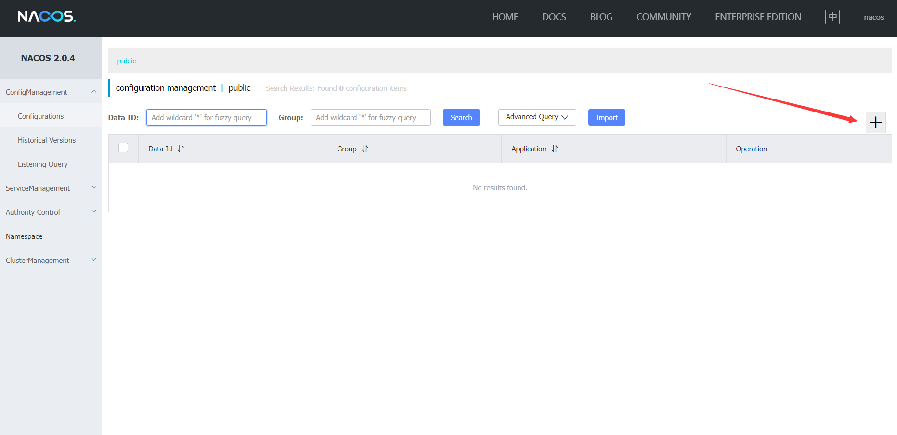
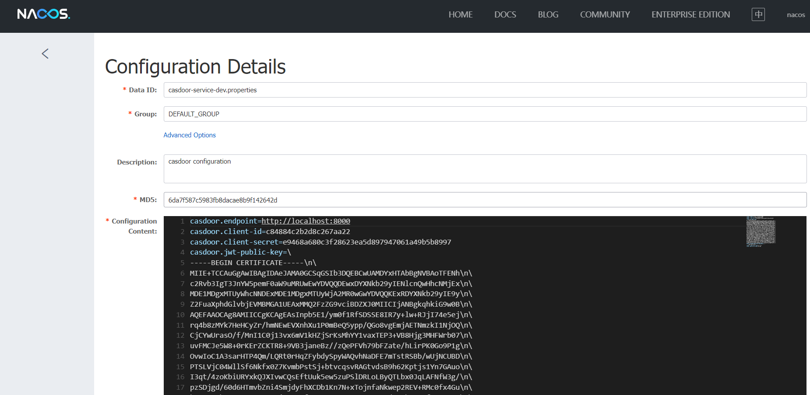

[casdoor-spring-boot-example](https://github.com/casdoor/casdoor-spring-boot-example) is an example on how to use [casdoor-spring-boot-starter](https://github.com/casdoor/casdoor-spring-boot-starter) in SpringBoot project. We will show you the steps below.

## Step1. Deploy Casdoor

Firstly, the Casdoor should be deployed.

You can refer to the Casdoor official documentation for the [Server Installation](/docs/basic/server-installation). Please deploy your Casdoor instance in **production mode**.

After a successful deployment, you need to ensure:

- Open your favorite browser and visit **http://localhost:8000**, you will see the login page of Casdoor.
- Input `admin` and `123` to test login functionality is working fine.

Then you can quickly implement a casdoor based login page in your own app with the following steps.

## Step2. Import casdoor-spring-boot-starter

You can import the casdoor-spring-boot-starter with  maven or gradle.

```
<!-- https://mvnrepository.com/artifact/org.casbin/casdoor-spring-boot-starter -->
<dependency>
    <groupId>org.casbin</groupId>
    <artifactId>casdoor-spring-boot-starter</artifactId>
    <version>1.x.y</version>
</dependency>
```


```
// https://mvnrepository.com/artifact/org.casbin/casdoor-spring-boot-starter
implementation group: 'org.casbin', name: 'casdoor-spring-boot-starter', version: '1.x.y'
```


<h2 id="3">Step3. Init Config</h2>
Initialization requires 6 parameters, which are all string type.

| Name (in order)  | Must | Description                                         |
|------------------|------|-----------------------------------------------------|
| endpoint         | Yes  | Casdoor Server Url, such as `http://localhost:8000` |
| clientId         | Yes  | Application.client_id                               |
| clientSecret     | Yes  | Application.client_secret                           |
| jwtPublicKey     | Yes  | The public key for the Casdoor application's cert   |
| organizationName | Yes  | Application.organization                            |
| applicationName  | No   | Application.name                                    |

You can use Java properties or YAML files to init as below.

```properties
casdoor.endpoint = http://localhost:8000
casdoor.clientId = <client-id>
casdoor.clientSecret = <client-secret>
casdoor.jwtSecret = <jwt-public-key>
casdoor.organizationName = built-in
casdoor.applicationName = app-built-in
```

```yaml
casdoor:
  endpoint: http://localhost:8000
  client-id: <client-id>
  client-secret: <client-secret>
  jwt-public-key: <jwt-public-key>
  organization-name: built-in
  application-name: app-built-in
```


:::caution

You should replace the configuration with your own Casdoor instance especially the `clientId`, `clientSecret` and the `jwtPublicKey`.

:::

## Step4. service discovery

- What is a registry

Registries play a very important role in microservice projects. They are the link in the microservice architecture, similar to the address book, which records the mapping between services and service addresses. In a distributed architecture, services are registered here, and when a service needs to call another service, it finds the address of the service and makes the call.

- Why use a registry

The registry addresses service discovery issues. In the absence of a registry, inter-service calls need to know the address of the called party or the proxy address. When a service changes its deployment address, it has to change the address specified in the call or change the proxy configuration. With the registry, each service only needs to know the service name when calling others, and the address will be synchronized through the registry.
- Nacos service discovery

  Nacos is an easy-to-use dynamic service discovery, configuration and service management platform for building cloud native applications.

###Download&Build from Release
**Download** 

**1) Download source code from Github**
```
git clone https://github.com/alibaba/nacos.git
cd nacos/
mvn -Prelease-nacos -Dmaven.test.skip=true clean install -U 
ls -al distribution/target/

// change the $version to your actual path
cd distribution/target/nacos-server-$version/nacos/bin
```
  

**2)Download run package**

download nacos-server-$version.zip form https://github.com/alibaba/nacos/releases.
```
unzip nacos-server-$version.zip or tar -xvf nacos-server-$version.tar.gz
  cd nacos/bin
```
### Start Server
- Linux/Unix/Mac

  Run the following command to start(standalone means non-cluster mode):
```
sh startup.sh -m standalone
```


- Windows

Go to the nacos/bin directory， Run the following command to start(standalone means non-cluster mode):

```
startup.cmd -m standalone
```


Nacosprovides a visual operating platform，Start the server，Open your favorite browser and visit http://localhost:8848/nacos ，the default user name and password are `nacos`.

###How to use

1. Add the dependency

```
<dependency>
	<groupId>com.alibaba.cloud</groupId>
	<artifactId>spring-cloud-starter-alibaba-nacos-discovery</artifactId>
</dependency>
```

2. add Nacos config

```
spring:
  application:
    name: casdoor-service
  cloud:
    nacos:
      discovery:
        server-addr: 127.0.0.1:8848
```

3. 在Application启动类加入注解@EnableDiscoveryClient
   
4. start server，view the list of services for the Nacos console
   

## Step5. config center
you can also use nacos config, Put these casdoor configurations in the configuration center
### introduction
- What is a configuration center?

  In a microservice architecture, when the system is split from a single application into service nodes on a distributed system, the configuration files must be migrated (split), so that the configuration is dispersed, and the decentralization involves redundancy.
  In general, a configuration center is a basic service component that centrally manages the configuration of various applications.

- Why use a configuration center?

  The configuration center separates configurations from applications and manages configurations in a unified manner. Applications do not need to manage configurations themselves.

- Nacos Config center

  is alibaba's open source platform for dynamic service discovery, configuration management and service management, which is easier to build cloud native applications.
###How to use
1. Add the dependency
```
<dependency>
	<groupId>com.alibaba.cloud</groupId>
	<artifactId>spring-cloud-starter-alibaba-nacos-config</artifactId>
</dependency>
```
2. Add the Nacos configuration in `bootstrap.yml`
```spring:
  application:
    name: casdoor-service
  profiles:
    active: dev
  cloud:
    nacos:
      config:
        server-addr: 127.0.0.1:8848
        file-extension: yaml
```
Configuration file loading priority (from highest to lowest)
`bootstrap.properties ->bootstrap.yml -> application.properties -> application.yml`
3.  Enable service discovery by adding the Spring Cloud native annotation of @EnableDiscoveryClient
   
4. Add a configuration to the configuration center （Data Id）



   in Nacos Spring Cloud, the format of `dataId` is as follows:
  ` ${prefix}-${spring.profiles.active}.${file-extension}`

- The value of `prefix` is the value of `spring.application.name` by default. You can also configure this value in `spring.cloud.nacos.config.prefix`.
- `spring.profiles.active` is the profile of the current environment.  
- `file-exetension` is the data format of the configuration content, and can be configured in `spring.cloud.nacos.config.file-extension` . 

We can match our **dataId** as  `casdoor-service-dev.properties` ，The configuration format is `properties`，

The configuration content is the configuration in [step 3](#3), so that the contents of the [step 3](#3) configuration file can be placed in the nacos configuration center.

## Step5. Redirect to the login page

When you need the authentication who access your app, you can send the target url and redirect to the login page provided by Casdoor.

Please be sure that you have added the callback url (e.g. **http://localhost:8080/login**) in application configuration in advance.

```java
@Resource
private CasdoorAuthService casdoorAuthService;

@RequestMapping("toLogin")
public String toLogin() {
    return "redirect:" + casdoorAuthService.getSigninUrl("http://localhost:8080/login");
}
```

## Step6. Get token and parse

After Casdoor verification passed, it will be redirected to your application with code and state.

You can get the code and call `getOAuthToken` method, then parse out jwt token.

`CasdoorUser` contains the basic information about the user provided by Casdoor, you can use it as a keyword to set the session in your application.

```java
@RequestMapping("login")
public String login(String code, String state, HttpServletRequest request) {
    String token = "";
    CasdoorUser user = null;
    try {
        token = casdoorAuthService.getOAuthToken(code, state);
        user = casdoorAuthService.parseJwtToken(token);
    } catch (CasdoorAuthException e) {
        e.printStackTrace();
    }
    HttpSession session = request.getSession();
    session.setAttribute("casdoorUser", user);
    return "redirect:/";
}
```

## Service

Examples of APIs are shown below.

- CasdoorAuthService
    - `String token = casdoorAuthService.getOAuthToken(code, "app-built-in");`
    - `CasdoorUser casdoorUser = casdoorAuthService.parseJwtToken(token);`
- CasdoorUserService
    - `CasdoorUser casdoorUser = casdoorUserService.getUser("admin");`
    - `CasdoorUser casdoorUser = casdoorUserService.getUserByEmail("admin@example.com");`
    - `CasdoorUser[] casdoorUsers = casdoorUserService.getUsers();`
    - `CasdoorUser[] casdoorUsers = casdoorUserService.getSortedUsers("created_time", 5);`
    - `int count = casdoorUserService.getUserCount("0");`
    - `CasdoorResponse response = casdoorUserService.addUser(user);`
    - `CasdoorResponse response = casdoorUserService.updateUser(user);`
    - `CasdoorResponse response = casdoorUserService.deleteUser(user);`
- CasdoorEmailService
    - `CasdoorResponse response = casdoorEmailService.sendEmail(title, content, sender, receiver);`
- CasdoorSmsService
    - `CasdoorResponse response = casdoorSmsService.sendSms(randomCode(), receiver);`
- CasdoorResourceService
    - `CasdoorResponse response = casdoorResourceService.uploadResource(user, tag, parent, fullFilePath, file);`
    - `CasdoorResponse response = casdoorResourceService.deleteResource(file.getName());`

## What's more

You can explore the following projects/docs to learn more about the integration of Java with Casdoor.

- [casdoor-java-sdk](https://github.com/casdoor/casdoor-java-sdk)
- [casdoor-spring-boot-starter](https://github.com/casdoor/casdoor-spring-boot-starter)
- [casdoor-spring-boot-example](https://github.com/casdoor/casdoor-spring-boot-example)
- [casdoor-spring-boot-security-example](https://casdoor.org/docs/integration/spring-security)
- [casdoor-spring-boot-shiro-example](https://github.com/casdoor/casdoor-spring-boot-shiro-example)
