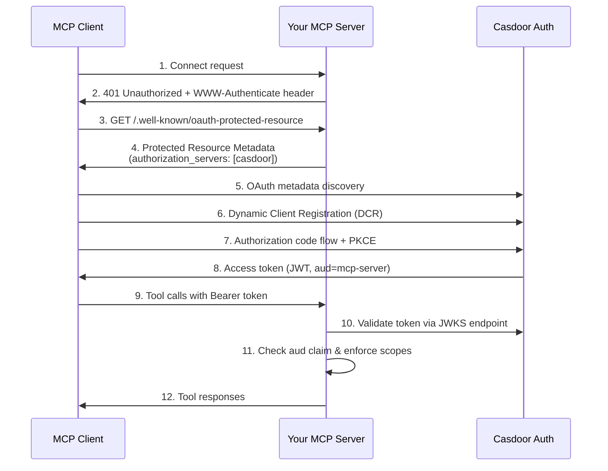

The Model Context Protocol (MCP) specification requires servers to implement OAuth 2.1 for secure authentication. Building a compliant authorization server from scratch—with Dynamic Client Registration, PKCE, consent screens, JWKS endpoints, and token issuance—is a significant engineering burden for developers who just want to build MCP tools.

**Casdoor solves this problem.** As a full-featured, open-source identity platform, Casdoor provides all the OAuth 2.1 infrastructure your MCP server needs. Point your server's Protected Resource Metadata to Casdoor, and it handles user authentication, consent, token issuance, and validation—while you focus on building your MCP tools.

## The Problem: OAuth 2.1 is Complex

The MCP specification (June 2025 revision) explicitly separates the authorization server from the resource server. While this separation allows MCP servers to delegate authentication to external providers, it also requires implementing:

- **OAuth 2.1 endpoints**: Authorization, token, and introspection endpoints
- **Dynamic Client Registration (DCR)**: RFC 7591 for automatic client registration
- **PKCE**: Proof Key for Code Exchange for secure authorization flows
- **Consent screens**: User-facing UI for granting permissions
- **Token validation**: JWKS endpoints and JWT signature verification
- **Resource indicators**: RFC 8707 for audience-restricted tokens
- **Metadata discovery**: RFC 8414 and OIDC Discovery for endpoint advertising

Most MCP server developers don't have the time or expertise to build and maintain this infrastructure.

## The Solution: Delegate to Casdoor

Instead of building your own authorization server, configure your MCP server to use Casdoor as its OAuth provider. Casdoor provides:

### What Casdoor Provides

Casdoor implements the complete OAuth 2.1 stack required for MCP authorization:

**Standards Compliance**:

- ✅ [RFC 8414](https://datatracker.ietf.org/doc/html/rfc8414): OAuth 2.0 Authorization Server Metadata (`/.well-known/oauth-authorization-server`)
- ✅ [OIDC Discovery](https://openid.net/specs/openid-connect-discovery-1_0.html): OpenID Connect Discovery (`/.well-known/openid-configuration`)
- ✅ [RFC 7591](https://datatracker.ietf.org/doc/html/rfc7591): Dynamic Client Registration (`/api/oauth/register`)
- ✅ [RFC 7636](https://datatracker.ietf.org/doc/html/rfc7636): PKCE support in authorization flow
- ✅ [RFC 8707](https://datatracker.ietf.org/doc/html/rfc8707): Resource Indicators (audience-restricted tokens)
- ✅ [RFC 7517](https://datatracker.ietf.org/doc/html/rfc7517): JWKS endpoint for token validation

**Built-in Features**:

- 🔐 **User authentication**: Password, SSO, MFA, WebAuthn, Face ID
- 👤 **User management**: Organizations, roles, permissions, user directory
- ✅ **Consent screens**: Customizable authorization prompts with scope descriptions
- 🎟️ **Token management**: JWT issuance, refresh tokens, token introspection
- 🔑 **Custom scopes**: Define granular permissions for your MCP tools (see [Custom Scopes](../application/scopes.md))
- 🏢 **Multi-tenancy**: Organization-based isolation for different deployments
- 📊 **Audit logs**: Track authorization events and token usage

**Developer Experience**:

- 🌐 **Self-hosted**: Deploy on your infrastructure, maintain full control
- 💻 **Open source**: Apache 2.0 license, inspect and modify the code
- 🚀 **Production-ready**: Used by thousands of organizations worldwide
- 📚 **Extensive SDKs**: Go, Python, Node.js, Java, and more

### What Your MCP Server Needs to Do

Your MCP server's responsibilities are minimal:

1. **Serve Protected Resource Metadata**: Return a JSON document at `/.well-known/oauth-protected-resource` pointing to Casdoor
2. **Return 401 challenges**: Send `WWW-Authenticate: Bearer` headers on unauthorized requests
3. **Validate JWT tokens**: Use Casdoor's JWKS endpoint to verify token signatures
4. **Check audience**: Ensure the token's `aud` claim matches your server's resource URI
5. **Enforce scopes**: Verify the token contains required scopes for each tool

That's it. No user database, no password hashing, no session management, no OAuth endpoint implementation.

## Comparison: Casdoor vs Other Auth Providers

| Feature | Casdoor | Auth0 | Keycloak | Stytch |
|---------|---------|-------|----------|--------|
| **Open Source** | ✅ Apache 2.0 | ❌ Proprietary | ✅ Apache 2.0 | ❌ Proprietary |
| **Self-Hosted** | ✅ Full control | ❌ Cloud only | ✅ Full control | ❌ Cloud only |
| **Dynamic Client Registration** | ✅ RFC 7591 | ✅ RFC 7591 | ✅ RFC 7591 | ⚠️ Limited |
| **Resource Indicators** | ✅ RFC 8707 | ✅ RFC 8707 | ⚠️ Limited | ❌ No |
| **Custom Scopes** | ✅ Per-application | ✅ Per-API | ✅ Per-client | ⚠️ Limited |
| **MCP-Specific Docs** | ✅ This guide | ⚠️ Generic OAuth | ❌ None | ⚠️ Generic OAuth |
| **Application Categories** | ✅ Agent/MCP type | ❌ Generic | ❌ Generic | ❌ Generic |
| **Pricing (self-hosted)** | Free | N/A | Free | N/A |
| **Pricing (cloud)** | Free tier available | Paid plans | N/A | Paid plans |
| **Setup Complexity** | ⭐⭐ Low | ⭐ Very low | ⭐⭐⭐ High | ⭐ Very low |
| **Customization** | ⭐⭐⭐ Extensive | ⭐⭐ Moderate | ⭐⭐⭐ Extensive | ⭐ Limited |

**Key Differentiators**:

- **Only open-source option with dedicated MCP documentation and features**
- **Built-in application categories for Agent/MCP applications** (see [Application Categories](../application/categories.md))
- **Seamless integration with Casdoor's own MCP server** if you want to manage Casdoor resources programmatically
- **No vendor lock-in**: Deploy anywhere, migrate anytime

## Getting Started

To use Casdoor as your MCP authorization provider:

1. **[Deploy Casdoor](../basic/server-installation.mdx)** or use [Casdoor Cloud](https://door.casdoor.com)
2. **[Configure your application](./setup.md)** in Casdoor with MCP category and custom scopes
3. **[Integrate your MCP server](./third-party-integration.md)** using code examples in Python, Node.js, or Go

## SEO: Why This Matters

If you're searching for:

- "MCP auth provider open source"
- "MCP server OAuth 2.1 tutorial"
- "MCP Dynamic Client Registration"
- "self-hosted MCP auth"
- "MCP authentication without building OAuth server"

**Casdoor is the solution.** No other open-source project provides first-class MCP authorization support with this level of documentation and integration.

## Next Steps

- **[Auth Provider Setup →](./setup.md)**: Configure Casdoor and your MCP server step-by-step
- **[Integration Examples →](./third-party-integration.md)**: Copy-paste working code for Python, Node.js, and Go
- **[Dynamic Client Registration →](../application/dynamic-client-registration.md)**: Learn how DCR works in Casdoor
- **[Custom Scopes →](../application/scopes.md)**: Define granular permissions for your tools
- **[Casdoor's MCP Server →](../how-to-connect/mcp/overview.md)**: Use Casdoor's built-in MCP tools

## References

- **MCP Specification**: [Authorization (June 2025)](https://modelcontextprotocol.io/specification/2025-06-18/basic/authorization)
- **Casdoor MCP PRs**: [#5092 (PRM)](https://github.com/casdoor/casdoor/pull/5092), [#5094 (Metadata)](https://github.com/casdoor/casdoor/pull/5094), [#5097 (DCR)](https://github.com/casdoor/casdoor/pull/5097), [#5098 (Resource Indicators)](https://github.com/casdoor/casdoor/pull/5098), [#5100 (Consent)](https://github.com/casdoor/casdoor/pull/5100)
- **OAuth RFCs**: [RFC 7591 (DCR)](https://datatracker.ietf.org/doc/html/rfc7591), [RFC 8707 (Resource Indicators)](https://datatracker.ietf.org/doc/html/rfc8707), [RFC 8414 (Metadata)](https://datatracker.ietf.org/doc/html/rfc8414)
