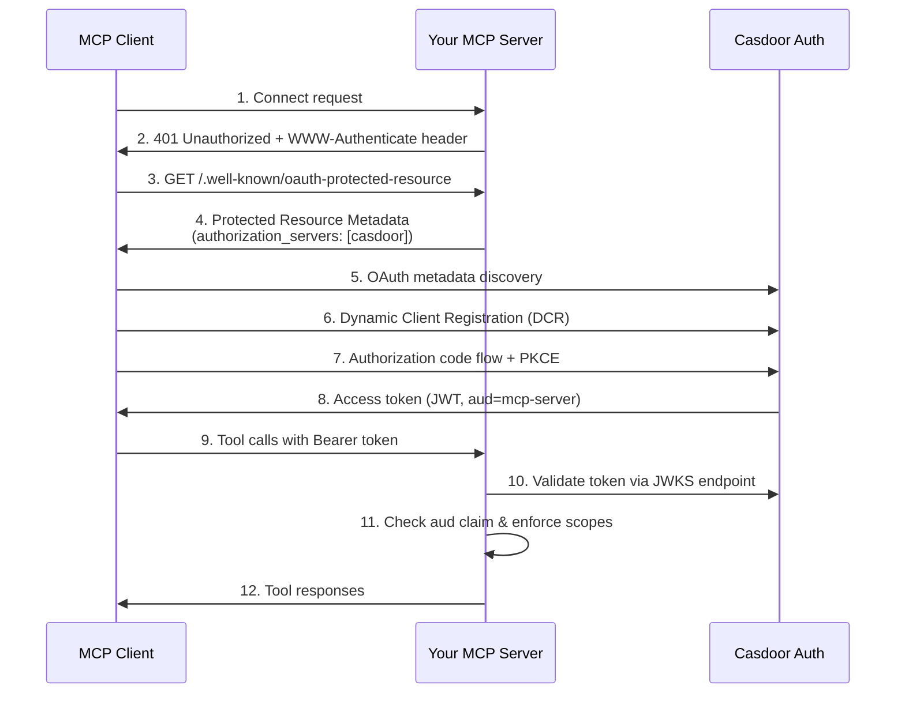

The Model Context Protocol (MCP) specification separates the authorization server from the MCP server, which is the resource server. Your MCP server doesn't have to sign users in or issue tokens: it points clients to an authorization server and validates the tokens that the authorization server issues. Casdoor can be that authorization server.

This section explains how to set this up. To manage Casdoor itself from an MCP client, see the [MCP server of Casdoor](/docs/how-to-connect/mcp/overview) instead.

## How the parts work together

```mermaid
sequenceDiagram
    participant Client as MCP Client
    participant Server as Your MCP Server
    participant Casdoor as Casdoor Auth

    Client->>Server: 1. Connect request
    Server->>Client: 2. 401 Unauthorized + WWW-Authenticate header
    Client->>Server: 3. GET /.well-known/oauth-protected-resource
    Server->>Client: 4. Protected Resource Metadata<br/>(authorization_servers: [casdoor])
    Client->>Casdoor: 5. OAuth metadata discovery
    Client->>Casdoor: 6. Dynamic Client Registration (DCR)
    Client->>Casdoor: 7. Authorization code flow + PKCE
    Casdoor->>Client: 8. Access token (JWT, aud=mcp-server)
    Client->>Server: 9. Tool calls with Bearer token
    Server->>Casdoor: 10. Validate token via JWKS endpoint
    Server->>Server: 11. Check aud claim & enforce scopes
    Server->>Client: 12. Tool responses
```

## What Casdoor provides

The authorization server of an MCP server has to implement several standards. Casdoor implements all of them:

| Standard | Endpoint or feature |
|---|---|
| [RFC 8414](https://datatracker.ietf.org/doc/html/rfc8414): OAuth 2.0 Authorization Server Metadata | `/.well-known/oauth-authorization-server` |
| [OpenID Connect Discovery](https://openid.net/specs/openid-connect-discovery-1_0.html) | `/.well-known/openid-configuration` |
| [RFC 7591](https://datatracker.ietf.org/doc/html/rfc7591): Dynamic Client Registration | `/api/oauth/register` |
| [RFC 7636](https://datatracker.ietf.org/doc/html/rfc7636): PKCE | Authorization code flow |
| [RFC 8707](https://datatracker.ietf.org/doc/html/rfc8707): Resource Indicators | Tokens whose audience is your MCP server |
| [RFC 7517](https://datatracker.ietf.org/doc/html/rfc7517): JSON Web Key Set | `/.well-known/jwks`, for token validation |

Casdoor also provides what surrounds these standards:

- **Sign-in**: Passwords, single sign-on, multi-factor authentication, WebAuthn, and Face ID
- **Users**: Organizations, roles, permissions, and the user directory
- **Consent**: A consent screen that lists the requested scopes with their descriptions
- **Tokens**: JSON Web Token (JWT) issuance, refresh tokens, and token introspection
- **Custom scopes**: Permissions that you define for your tools. See [Define custom scopes](/docs/application/scopes)
- **Application categories**: The category `Agent` with the type `MCP`. See [Application categories](/docs/application/categories)
- **Self-hosting**: Casdoor is open source under the Apache 2.0 license and runs on your own infrastructure

## What your MCP server does

1. **Publish Protected Resource Metadata**: Return a JSON document at `/.well-known/oauth-protected-resource` that names Casdoor as the authorization server.
1. **Challenge unauthenticated requests**: Answer them with HTTP 401 and a `WWW-Authenticate: Bearer` header.
1. **Validate tokens**: Verify the signature of each JWT with the JWKS of Casdoor.
1. **Check the audience**: Check that the `aud` claim of the token is the resource URI of your server.
1. **Enforce scopes**: Check that the token contains the scope that each tool requires.

Your server needs no user database, no password storage, no session management, and no OAuth 2.0 endpoints of its own.

## Get started {#getting-started}

1. [Install Casdoor](/docs/basic/server-installation), or use [Casdoor Cloud](https://www.casdoor.com/pricing?utm_source=casdoor.ai&utm_medium=docs&utm_content=mcp-auth).
1. [Configure Casdoor and your MCP server](/docs/mcp-auth/setup).
1. [Add the token validation to your server](/docs/mcp-auth/third-party-integration), with examples in Python, Node.js, and Go.

## See also

- [MCP authorization specification](https://modelcontextprotocol.io/specification/2025-06-18/basic/authorization)
- [Register clients dynamically](/docs/application/dynamic-client-registration)
- [OAuth 2.0](/docs/how-to-connect/oauth)
- Casdoor pull requests that added these features: [#5092 (Protected Resource Metadata)](https://github.com/casdoor/casdoor/pull/5092), [#5094 (metadata)](https://github.com/casdoor/casdoor/pull/5094), [#5097 (DCR)](https://github.com/casdoor/casdoor/pull/5097), [#5098 (resource indicators)](https://github.com/casdoor/casdoor/pull/5098), [#5100 (consent)](https://github.com/casdoor/casdoor/pull/5100)
