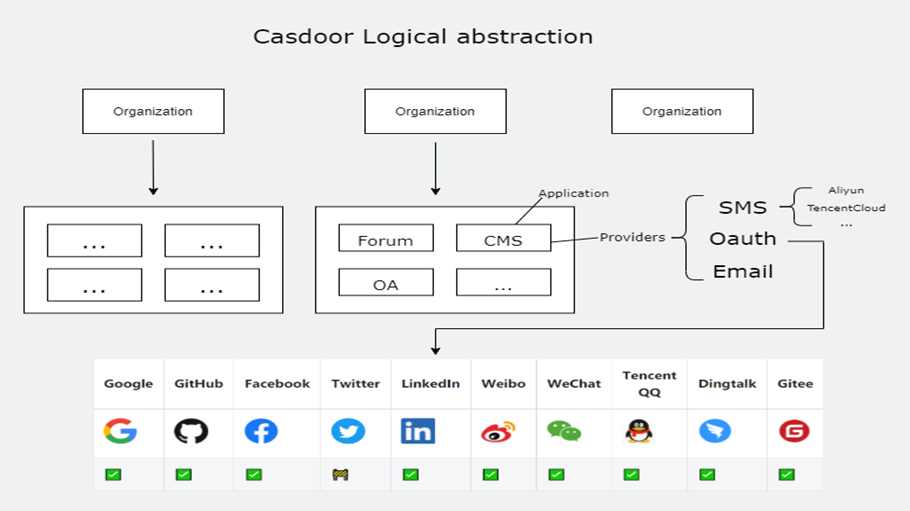

```mdx-code-block
import styles from './styles.module.css';
```

Casdoor is a UI-first centralized authentication / [Single-Sign-On (SSO)](https://en.wikipedia.org/wiki/Single_sign-on) platform based on OAuth 2.0 / OIDC.

```mdx-code-block
<div className={styles.gradientborder}>
<iframe src="https://door.casbin.com/login" width="600" height= "620" frameborder="0" scrolling="no"></iframe>
</div>
```

Casdoor serves both the web UI and the login requests from the application users.

## Casdoor features:

1. Front-end and back-end separate architecture, developed by Golang, Casdoor supports high concurrency, provides web-based managing UI and supports multiple languages(Chinese, English).

2. Casdoor supports Github, Google, QQ, WeChat third-party applications login, and support the extension of third-party login with plugins.

3. With [Casbin](https://casbin.org/) based authorization management, Casdoor supports ACL, RBAC, ABAC, RESTful accessing control models.

4. Phone verification code, email verification code and forget password features.

5. Accessing logs auditing and recording.

6. Alibaba Cloud, Tencent Cloud, Qiniu Cloud image CDN cloud storage.

7. Customizable register, login, and forget password pages.

8. Casdoor supports integration with existing systems using db sync method, users can transition to Casdoor smoothly.

9. Casdoor supports mainstream databases: MySQL, PostgreSQL, SQL Server etc,  and support the extension of new database with plugins.

## Online demo

### Casdoor

Here is an online demo deployed by Casbin.

- [Casdoor official demo](https://door.casbin.com/)

Global admin login: 

- Username: `admin`
- Password: `123`

### Casbin-OA

Casbin-OA is one of Casbin web apps. It uses Casdoor as authentication.

- [Casbin-OA](https://oa.casbin.com)
- Source code: https://github.com/casbin/casbin-oa

### Casnode

Casnode is the official forum developed by Casbin community.

It uses Casdoor as authentication platform and manage members.

* [Casnode](https://casnode.com)
* Source code: https://github.com/casbin/casnode

## Architecture

Casdoor contains 2 parts:

Name | Description | Language | Source code
----|------|----|----
Frontend | Web frontend UI for Casdoor | JavaScript + React | https://github.com/casbin/casdoor/tree/master/web
Backend | RESTful API backend for Casdoor | Golang + Beego + SQL | https://github.com/casbin/casdoor

Architecture diagram:



