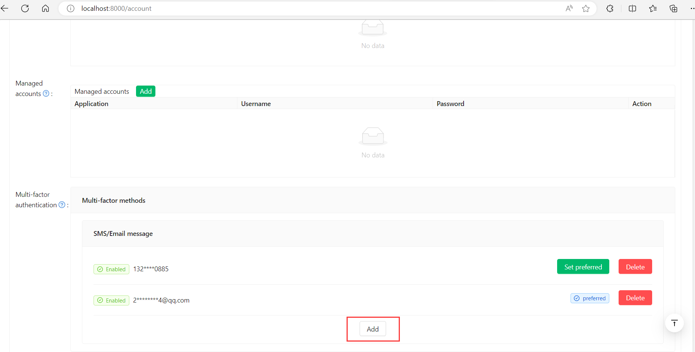
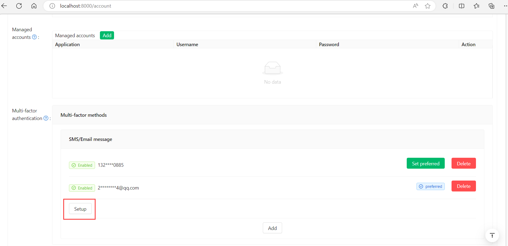
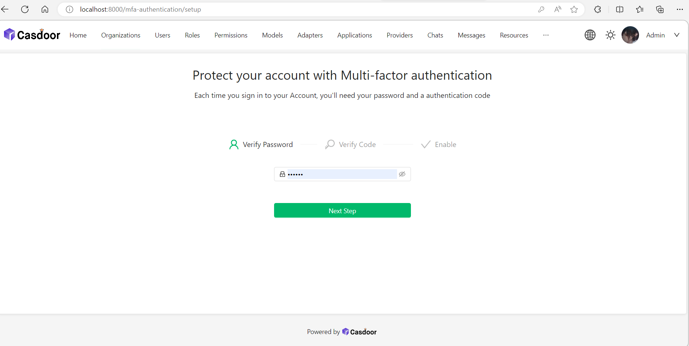
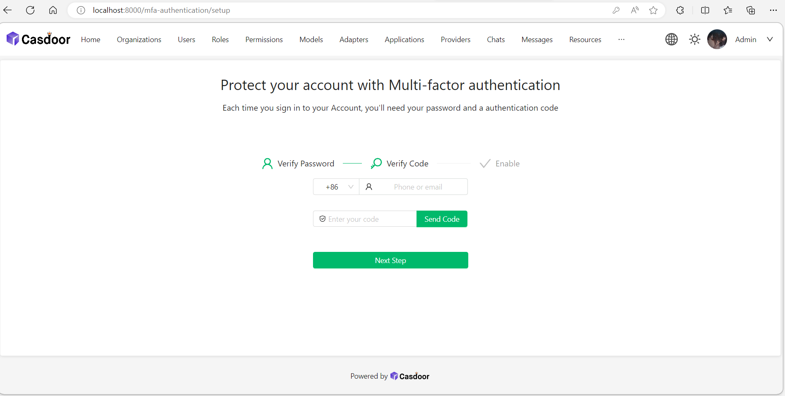
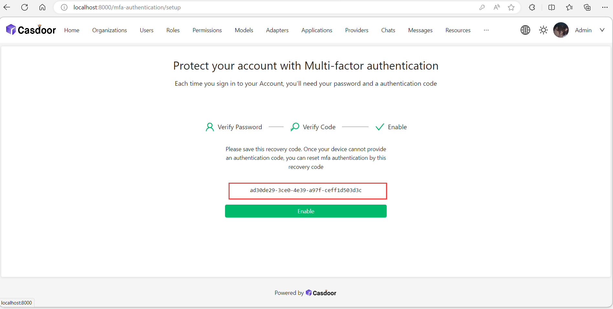
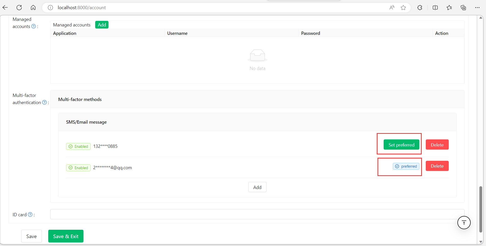

## About multi-factor authentication

MFA (Multi-Factor Authentication) is a security measure that can improve the security of users and systems. It requires 
users to provide two or more factors of authentication to verify their identity when logging in or performing sensitive operations.

For Casdoor, the second form of authentication is a code that's sent as a text message or email. After you enable MFA, 
Casdoor generates an authentication code any time someone attempts to sign in your account. The only way someone can sign in your account is if they know both your password and have access to the authentication code.

## Config MFA
1. In the Use page, click the "add" button.

2. After added a new line, click the "setup" button.

3. Type your password and click "Next Step".

### Configuring multi-factor authentication using text messages or email

- Select your country code and type your mobile phone number. When your information is correct, click "Send Code".
- If you want to use email, type your email address. Then click "Send Code".

You'll receive a text message or email with a security code. On Casdoor, type the code into the field "Enter your code" and click "Next Step".

Above "Enable" button, copy your recovery codes and save to your device. Save them to a secure location because your recovery codes can help you get back into your account if you lose access.

## Changing your preferred MFA method

You can add multiple MFA methods. Only the preferred method will be used when you sign in.   

If you want to set a preferred MFA method, click the "Set preferred" button.

A "Preferred" label is displayed on your preferred method.
