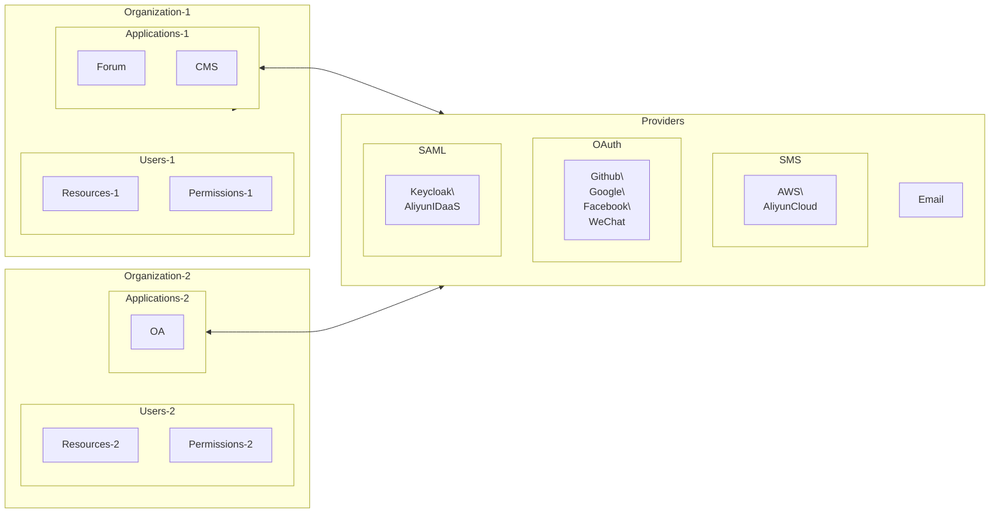

作为Casdoor的管理员，您至少应该熟悉4个核心概念： `组织(Organization)`， `用户(User)`, `应用(Application)` 和 `提供商(Provider)`。



:::tip

接下来，我们将使用演示站点：https://door.casdoor.com

:::

## 组织

在Casdoor中， 组织是用户和应用程序的容器。 例如，一个公司的所有雇员或一个企业的所有客户都可以抽象成为一个组织。 组织的类别定义如下：

```go
type Organization struct {
    Owner       string `xorm:"varchar(100) notnull pk" json:"owner"`
    Name        string `xorm:"varchar(100) notnull pk" json:"name"`
    CreatedTime string `xorm:"varchar(100)" json:"createdTime"`

    DisplayName        string   `xorm:"varchar(100)" json:"displayName"`
    WebsiteUrl         string   `xorm:"varchar(100)" json:"websiteUrl"`
    Favicon            string   `xorm:"varchar(100)" json:"favicon"`
    PasswordType       string   `xorm:"varchar(100)" json:"passwordType"`
    PasswordSalt       string   `xorm:"varchar(100)" json:"passwordSalt"`
    PhonePrefix        string   `xorm:"varchar(10)"  json:"phonePrefix"`
    DefaultAvatar      string   `xorm:"varchar(100)" json:"defaultAvatar"`
    Tags               []string `xorm:"mediumtext" json:"tags"`
    MasterPassword     string   `xorm:"varchar(100)" json:"masterPassword"`
    EnableSoftDeletion bool     `json:"enableSoftDeletion"`
    IsProfilePublic    bool     `json:"isProfilePublic"`

    AccountItems []*AccountItem `xorm:"varchar(2000)" json:"accountItems"`
}
```

## 用户

Casdoor 中的用户可以登录到一个应用程序。 一个用户只能属于一个组织，但可以登录到该组织拥有的多个应用程序。 Casdoor目前有两种类型的用户：

- 内置用户(`built-in` 组织下的所有用户)，例如 `built-in/admin`：全局管理员，在Casdoor平台上拥有完整的管理员权限。
- 其他组织下的用户，如 `my-company/Alice`：普通用户，只能注册、登录、登出、更改他/她自己的个人资料等。

在 Casdoor API中, 用户通常被定义为 `<organization_name>/<username>`, e.g., Casdoor的默认管理员被定义为 `built-in/admin`. 用户名权限中有一个名为 `id`的属性, 这是一个类似`d835a48f-2e88-4c1f-b907-60ac6b6c1b40`的 UUID ，它也可以是用户通过一个应用程序选择的 ID。

:::tip

如果您的应用程序仅应用于一个组织, 您可以使用`<username>` instead of `<organization_name>/<username>` 作为您整个应用程序的用户ID。

:::

用户的类别定义如下：

```go
type User struct {
    Owner       string `xorm:"varchar(100) notnull pk" json:"owner"`
    Name        string `xorm:"varchar(100) notnull pk" json:"name"`
    CreatedTime string `xorm:"varchar(100)" json:"createdTime"`
    UpdatedTime string `xorm:"varchar(100)" json:"updatedTime"`

    Id                string   `xorm:"varchar(100)" json:"id"`
    Type              string   `xorm:"varchar(100)" json:"type"`
    Password          string   `xorm:"varchar(100)" json:"password"`
    PasswordSalt      string   `xorm:"varchar(100)" json:"passwordSalt"`
    DisplayName       string   `xorm:"varchar(100)" json:"displayName"`
    Avatar            string   `xorm:"varchar(500)" json:"avatar"`
    PermanentAvatar   string   `xorm:"varchar(500)" json:"permanentAvatar"`
    Email             string   `xorm:"varchar(100) index" json:"email"`
    Phone             string   `xorm:"varchar(100) index" json:"phone"`
    Location          string   `xorm:"varchar(100)" json:"location"`
    Address           []string `json:"address"`
    Affiliation       string   `xorm:"varchar(100)" json:"affiliation"`
    Title             string   `xorm:"varchar(100)" json:"title"`
    IdCardType        string   `xorm:"varchar(100)" json:"idCardType"`
    IdCard            string   `xorm:"varchar(100) index" json:"idCard"`
    Homepage          string   `xorm:"varchar(100)" json:"homepage"`
    Bio               string   `xorm:"varchar(100)" json:"bio"`
    Tag               string   `xorm:"varchar(100)" json:"tag"`
    Region            string   `xorm:"varchar(100)" json:"region"`
    Language          string   `xorm:"varchar(100)" json:"language"`
    Gender            string   `xorm:"varchar(100)" json:"gender"`
    Birthday          string   `xorm:"varchar(100)" json:"birthday"`
    Education         string   `xorm:"varchar(100)" json:"education"`
    Score             int      `json:"score"`
    Ranking           int      `json:"ranking"`
    IsDefaultAvatar   bool     `json:"isDefaultAvatar"`
    IsOnline          bool     `json:"isOnline"`
    IsAdmin           bool     `json:"isAdmin"`
    IsGlobalAdmin     bool     `json:"isGlobalAdmin"`
    IsForbidden       bool     `json:"isForbidden"`
    IsDeleted         bool     `json:"isDeleted"`
    SignupApplication string   `xorm:"varchar(100)" json:"signupApplication"`
    Hash              string   `xorm:"varchar(100)" json:"hash"`
    PreHash           string   `xorm:"varchar(100)" json:"preHash"`

    CreatedIp      string `xorm:"varchar(100)" json:"createdIp"`
    LastSigninTime string `xorm:"varchar(100)" json:"lastSigninTime"`
    LastSigninIp   string `xorm:"varchar(100)" json:"lastSigninIp"`

    Github   string `xorm:"varchar(100)" json:"github"`
    Google   string `xorm:"varchar(100)" json:"google"`
    QQ       string `xorm:"qq varchar(100)" json:"qq"`
    WeChat   string `xorm:"wechat varchar(100)" json:"wechat"`
    Facebook string `xorm:"facebook varchar(100)" json:"facebook"`
    DingTalk string `xorm:"dingtalk varchar(100)" json:"dingtalk"`
    Weibo    string `xorm:"weibo varchar(100)" json:"weibo"`
    Gitee    string `xorm:"gitee varchar(100)" json:"gitee"`
    LinkedIn string `xorm:"linkedin varchar(100)" json:"linkedin"`
    Wecom    string `xorm:"wecom varchar(100)" json:"wecom"`
    Lark     string `xorm:"lark varchar(100)" json:"lark"`
    Gitlab   string `xorm:"gitlab varchar(100)" json:"gitlab"`
    Apple    string `xorm:"apple varchar(100)" json:"apple"`
    AzureAD  string `xorm:"azuread varchar(100)" json:"azuread"`
    Slack    string `xorm:"slack varchar(100)" json:"slack"`

    Ldap       string            `xorm:"ldap varchar(100)" json:"ldap"`
    Properties map[string]string `json:"properties"`
}
```

## 应用程序

应用程序是指需要受Casdoor保护的网络服务。 例如，论坛网站、OA系统、CRM系统都属于应用程序。

```go
type Application struct {
    Owner       string `xorm:"varchar(100) notnull pk" json:"owner"`
    Name        string `xorm:"varchar(100) notnull pk" json:"name"`
    CreatedTime string `xorm:"varchar(100)" json:"createdTime"`

    DisplayName         string          `xorm:"varchar(100)" json:"displayName"`
    Logo                string          `xorm:"varchar(100)" json:"logo"`
    HomepageUrl         string          `xorm:"varchar(100)" json:"homepageUrl"`
    Description         string          `xorm:"varchar(100)" json:"description"`
    Organization        string          `xorm:"varchar(100)" json:"organization"`
    Cert                string          `xorm:"varchar(100)" json:"cert"`
    EnablePassword      bool            `json:"enablePassword"`
    EnableSignUp        bool            `json:"enableSignUp"`
    EnableSigninSession bool            `json:"enableSigninSession"`
    EnableCodeSignin    bool            `json:"enableCodeSignin"`
    Providers           []*ProviderItem `xorm:"mediumtext" json:"providers"`
    SignupItems         []*SignupItem   `xorm:"varchar(1000)" json:"signupItems"`
    OrganizationObj     *Organization   `xorm:"-" json:"organizationObj"`

    ClientId             string   `xorm:"varchar(100)" json:"clientId"`
    ClientSecret         string   `xorm:"varchar(100)" json:"clientSecret"`
    RedirectUris         []string `xorm:"varchar(1000)" json:"redirectUris"`
    TokenFormat          string   `xorm:"varchar(100)" json:"tokenFormat"`
    ExpireInHours        int      `json:"expireInHours"`
    RefreshExpireInHours int      `json:"refreshExpireInHours"`
    SignupUrl            string   `xorm:"varchar(200)" json:"signupUrl"`
    SigninUrl            string   `xorm:"varchar(200)" json:"signinUrl"`
    ForgetUrl            string   `xorm:"varchar(200)" json:"forgetUrl"`
    AffiliationUrl       string   `xorm:"varchar(100)" json:"affiliationUrl"`
    TermsOfUse           string   `xorm:"varchar(100)" json:"termsOfUse"`
    SignupHtml           string   `xorm:"mediumtext" json:"signupHtml"`
    SigninHtml           string   `xorm:"mediumtext" json:"signinHtml"`
}
```

每个应用程序都可以有自己的自定义注册页面，登录页等。 例如，根登录页面 `/登录` (例如：https://door.casdoor.com/login) 是只针对Casdoor的内置应用程序，在页面上的标志是： `app-build-in`。

应用程序是用户登录到Casdoor的“入口”或“界面”。 用户需要通过一个应用程序的登录页面才能登录到Casdoor。

| 应用程序        | 注册页面网址                                        | 登录页面网址                                                                                                                                                                  |
| ----------- | --------------------------------------------- | ----------------------------------------------------------------------------------------------------------------------------------------------------------------------- |
| 内置应用程序      | https://door.casdoor.com/signup               | https://door.casdoor.com/login                                                                                                                                          |
| casnode论坛系统 | https://door.casdoor.com/signup/app-casnode   | https://door.casdoor.com/login/oauth/authorize?client_id=014ae4bd048734ca2dea&response_type=code&redirect_uri=http://localhost:9000/callback&scope=read&state=casdoor |
| casbin的OA系统 | https://door.casdoor.com/signup/app-casbin-oa | https://door.casdoor.com/login/oauth/authorize?client_id=0ba528121ea87b3eb54d&response_type=code&redirect_uri=http://localhost:9000/callback&scope=read&state=casdoor |

### 登录 URL

通过Casdoor的内置应用程序登录到Casdoor非常容易，只需访问Casdoor服务器的主页(例如示例站点：https://door.casdoor.com)然后将会自动重定向您为 `/login`。 但如何在前端和后端代码中为其他应用程序获取这些URL？ 您可以将您自己的字符串连接起来，也可以调用 Casdoor SDK 提供的一些实用功能来获取 URL：

#### 1. 手动连接字符串：

- 注册页面URL
    - 注册指定的应用程序: `<your-casdoor-hostname>/signup/<your-application-name>`
    - 通过OAuth注册: `<your-casdoor-hostname>/signup/oauth/authorize?client_id=<client-id-for-your-application>&response_type=code&redirect_uri=<redirect-uri-for-your-application>&&scope=read&state=casdoor`
    - 自动注册: `<your-casdoor-hostname>/auto-signup/oauth/authorize?client_id=<client-id-for-your-application>&response_type=code&redirect_uri=<redirect-uri-for-your-application>&&scope=read&state=casdoor`
- 登录页面URL
    - 登录指定的组织: `<your-casdoor-hostname>/login/<your-organization-name>`
    - 通过OAuth登录: `<your-casdoor-hostname>/login/oauth/authorize?client_id=<client-id-for-your-application>&response_type=code&redirect_uri=<redirect-uri-for-your-application>&&scope=read&state=casdoor`

#### 2. 使用前端 SDK (用于使用 React、Vue 或 Angular 的 Javascript 代码)：

`getSignupUrl()` and `getSigninUrl()`: [casdoor-js-sdk](https://github.com/casdoor/casdoor-js-sdk/blob/3d08d726bcd5f62d6444b820596e2d8472f67d97/src/sdk.ts#L50-L63)

#### 3. 使用后端 SDK (使用Go Java 等后端代码)：

`GetSignupUrl()` and `GetSigninUrl()`: [casdoor-go-sdk](https://github.com/casdoor/casdoor-go-sdk/blob/f3ef1adff792e9a06af5682e0a3af9436ed24ed3/auth/url.go#L23-L39)

## 提供商

Casdoor是一个联合单点登录系统，通过OIDC、OAuth 和SAML支持多个身份提供者。 Casdoor 也可以通过电子邮件或短信(快速消息服务) 向用户发送验证码或其他通知。 Casdoor 使用这个概念： `Provider` 来管理所有这些第三方连接器。

Currently, All providers supported by Casdoor can be found here: **[provider/overview](/docs/provider/overview)**

```go
type Provider struct {
    Owner       string `xorm:"varchar(100) notnull pk" json:"owner"`
    Name        string `xorm:"varchar(100) notnull pk" json:"name"`
    CreatedTime string `xorm:"varchar(100)" json:"createdTime"`

    DisplayName   string `xorm:"varchar(100)" json:"displayName"`
    Category      string `xorm:"varchar(100)" json:"category"`
    Type          string `xorm:"varchar(100)" json:"type"`
    Method        string `xorm:"varchar(100)" json:"method"`
    ClientId      string `xorm:"varchar(100)" json:"clientId"`
    ClientSecret  string `xorm:"varchar(100)" json:"clientSecret"`
    ClientId2     string `xorm:"varchar(100)" json:"clientId2"`
    ClientSecret2 string `xorm:"varchar(100)" json:"clientSecret2"`

    Host    string `xorm:"varchar(100)" json:"host"`
    Port    int    `json:"port"`
    Title   string `xorm:"varchar(100)" json:"title"`
    Content string `xorm:"varchar(1000)" json:"content"`

    RegionId     string `xorm:"varchar(100)" json:"regionId"`
    SignName     string `xorm:"varchar(100)" json:"signName"`
    TemplateCode string `xorm:"varchar(100)" json:"templateCode"`
    AppId        string `xorm:"varchar(100)" json:"appId"`

    Endpoint         string `xorm:"varchar(1000)" json:"endpoint"`
    IntranetEndpoint string `xorm:"varchar(100)" json:"intranetEndpoint"`
    Domain           string `xorm:"varchar(100)" json:"domain"`
    Bucket           string `xorm:"varchar(100)" json:"bucket"`

    Metadata               string `xorm:"mediumtext" json:"metadata"`
    IdP                    string `xorm:"mediumtext" json:"idP"`
    IssuerUrl              string `xorm:"varchar(100)" json:"issuerUrl"`
    EnableSignAuthnRequest bool   `json:"enableSignAuthnRequest"`

    ProviderUrl string `xorm:"varchar(200)" json:"providerUrl"`
}
```

## Casdoor是如何自我管理的？

当您首次运行Casdoor时，Casdoor将创建一些内置的对象来帮助管理员管理Casdoor本身：

- 一个内置的命名为 `built-in` 的组织。
- `built-in` 组织下用户名为 ` admin `的用户 。
- 一个内置的应用程序名为 `app-built-in`, 由 `built-in` 组织所拥有，代表Casdoor 本身(实际上也是一个应用程序)。

`built-in` 组织中的所有用户，包括 `admin` 默认情况下将在Casdoor平台上拥有完整的管理员权限。 所以，如果你有多个管理员，可在 `built-in` 机构下创建新帐户。 否则，请记住关闭 `app-built-in` 应用程序的注册功能。

:::caution

内置对象已被禁止在网页UI或 RESTful API中重命名或删除。 Casdoor在许多地方硬编码了这些保留的名称。 不要试图重命名或删除它们，比如修改数据库，否则整个系统可能崩溃。

:::
